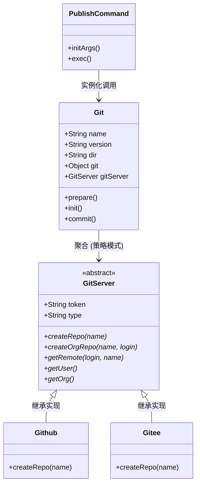
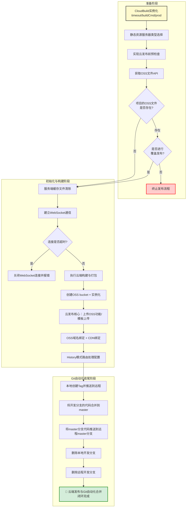

# 自研脚手架开发指南

# 1. 基于 Lerna / NPM Workspaces 搭建脚手架框架

## 1.1 基于 Lerna 搭建脚手架框架

初始化项目：

```bash
npm init -y 
```

安装 Lerna：

```bash
# 本地安装
npm i -D lerna@8

# 全局安装
npm i -g lerna@8

# 查看版本号
lerna -v 
```

创建并初始化脚手架目录：

```bash
mkdir my-cli-framework 
cd my-cli-framework

# 初始化，创建 lerna.json，并自动初始化 git 仓库
lerna init 
```

> **注意**：在 `.gitignore` 中忽略 `node_modules` 和 `packages/**/node_modules`。

## 1.2 创建 Package

**前提**：需要在 Git 中配置用户信息：

```bash
git config --global user.name "你的名字"
git config --global user.email "你的邮箱@example.com"
```

**根据模块功能拆分：**

- 核心模块：`core`
- 命令模块：`commands`
- 模型模块：`models`
- 工具模块：`utils`

在项目中，创建上述 4 个目录，并使用 `lerna create` 创建由 Lerna 管理的 package：

```bash
lerna create core      # 包名：@zt-cli/core
lerna create utils     # 包名：@zt-cli/utils
lerna create commands  # 包名：@zt-cli/commands
lerna create models    # 包名：@zt-cli/models
```

**调整 utils 目录结构**：
在 `utils` 目录下创建 `log` 子包，结构如下：

```text
utils
 ├── utils
 └── log
```

**调整 `package.json` 的 workspaces 配置**：
`"packages/*"` 只能匹配到像 `packages/core` 或 `packages/commands` 这样的一级子目录。由于 `log` 包是在 `packages/utils/log` 这样的二级目录下，所以需要补充 `"packages/utils/*"`：

```json
{
  "workspaces": [
    "packages/*",
    "packages/utils/*"
  ]
}
```

在 `log` 包中安装 `npmlog` 进行日志打印：

```bash
npm i npmlog -w @zt-cli/log
```

### 1.3 创建 bin 命令并测试

在 `core` 核心包中，注册一个 `bin` 命令，并测试一下 `npmlog`。

修改 `core/package.json`，增加如下代码：

```json
{
  "bin": {
    "zt-cli": "bin/index.js"
  }
}
```

创建 `core/bin/index.js`：

```javascript
#! /usr/bin/env node

const log = require("npmlog");

console.log("hello core");

log.info("INFO", "hello core");
log.error("ERROR", "hello core");
```

最后在控制台输出测试 `zt-cli` 命令：

```bash
D:\projects\zt-cli-framework\packages\core> zt-cli
hello core
info INFO hello core
ERR! ERROR hello core
```


第一次运行可能遇到的错误：


产生这个报错的原因是 xiaoxin-cli 命令没有被注册到系统的全局环境变量中 。

在开发本地的 CLI 脚手架时，虽然 packages/core/package.json 中配置了 "bin": { "xiaoxin-cli": "bin/index.js" } ，但系统并不知道这个命令的存在。我们需要通过 npm link 将它链接到全局。

我已经帮你定位了问题，并为你执行了以下修复操作：

1. 进入到了 packages/core 目录。
2. 运行了 npm link 命令。这个命令会在系统的全局 node_modules 目录下创建一个软链接，指向你当前的项目，从而让 xiaoxin-cli 命令可以在任何地方执行。


### 1.4 脚手架入口文件逻辑

修改 `bin/index.js`，优先使用项目本地安装的 CLI 版本，没有本地版本再使用全局安装的版本：

```javascript
#! /usr/bin/env node

const importLocal = require('import-local');

if (importLocal(__filename)) {
  require("npmlog").info("cli", "正在使用 zt-cli 的本地版本");
} else {
  require("../lib/core")(process.argv.slice(2));
}
```

### 1.5 创建 log 包

在 `utils/log` 包下面安装 `npmlog` 进行打印。`npmlog` 提供了一些打印级别，比如：`log.info`，`log.error`，`log.success` 等。

也可以进行扩展，修改 `utils/log/lib/index.js`：

```javascript
'use strict';

const log = require("npmlog");

// 根据环境变量设置日志级别，默认为 info
log.level = process.env.LOG_LEVEL || "info";
// 自定义日志前缀
log.heading = "zhentao";

// 自定义 success 等级，用于输出成功信息
log.addLevel("success", 2000, { fg: "green", bg: "black", bold: true });
// 自定义 debug 等级，用于输出调试信息，最低级别
log.addLevel("debug", 1000, { fg: "blue", bg: "black", bold: true });

module.exports = log;
```

**测试日志功能：**

1. 在 `core/lib/core.js` 中创建所有级别的日志输出：

```javascript
const log = require('@zt-cli/log');

function core() {
  // 打印所有级别的日志
  log.debug("调试", "这是 DEBUG 日志（最低级别，调试用）");
  log.verbose("详情", "这是 VERBOSE 日志（详细信息）");
  log.info("信息", "这是 INFO 日志（默认级别）");
  log.success("成功", "这是 SUCCESS 日志（自定义级别）");
  log.warn("警告", "这是 WARN 日志（警告）");
  log.error("错误", "这是 ERROR 日志（错误）");
}

module.exports = core;
```

2. 执行 `zt-cli` 命令，默认只会输出 `>= info` 级别的日志信息。

3. 修改环境变量，将日志级别修改为 `debug` 级别。

   如果你在使用 PowerShell 终端，请使用以下命令来设置环境变量并执行：

   **$env:LOG_LEVEL="debug"**

   如果你是在传统的 CMD (命令提示符) 终端下，则你原来的写法是正确的，可以连续执行：

   **set LOG_LEVEL=debug**

4. 再次执行 `zt-cli` 命令，会打印所有的日志。

### 1.6 检查 package.json 的版本号

修改 `core/lib/core.js`：

```javascript
'use strict';

const pkg = require('../package.json');
const log = require('@zt-cli/log');

function core() {
  checkPkgVersion();
}

function checkPkgVersion() {
  log.success("CLI 版本号:", pkg.version);
}

module.exports = core;
```

### 1.7 最低 Node 版本号检查

1. 安装 `semver` 进行版本比对，安装 `colors` 修改终端颜色：

```bash
npm install semver colors -w @zt-cli/core
```

2. 定义一个常量，保存允许的最低版本 `core/lib/const.js`：

```javascript
const LOWEST_NODE_VERSION = "13.0.0";

module.exports = {
  LOWEST_NODE_VERSION
};
```

3. 在 `core.js` 中进行版本比对：

```javascript
const semver = require('semver');
const colors = require('colors');
const constant = require('./const');

function core() {
  checkPkgVersion();
  checkNodeVersion();
}

function checkNodeVersion() {
  // 1. 获取当前 Node 的版本
  const currentVersion = process.version;
  // 2. 比对最低版本号
  const lowestVersion = constant.LOWEST_NODE_VERSION;

  if (!semver.gte(currentVersion, lowestVersion)) {
    throw new Error(colors.red(`zt-cli 需要安装 Node.js ${lowestVersion} 以上版本，当前 Node 版本 ${currentVersion} 低于最低版本 ${lowestVersion}`));
  }
}
```

### 1.8 用户主目录检查功能

安装依赖：

```bash
npm install user-home path-exists@4.0.0 -w @zt-cli/core
```

修改 `core.js`：

```javascript
const userHome = require('user-home');
const pathExists = require('path-exists');

function core() {
  try {
    checkPkgVersion();
    checkNodeVersion();
    checkUserHome();
  } catch (err) {
    log.error(err.message);
  }
}

function checkUserHome() {
  if (!userHome || !pathExists.sync(userHome)) {
    throw new Error(colors.red(`用户主目录不存在，无法继续执行`));
  }
}
```

### 1.9 入参检查

实现入参检查（`checkInputArgs`）主要是为了确保用户输入的命令和参数合法，并在必要时动态调整脚手架的运行状态（比如开启 Debug 模式）。

安装 `minimist`：

```bash
npm install minimist -w @zt-cli/core
```

修改 `core.js`：

```javascript
const minimist = require('minimist');

function core() {
  try {
    checkPkgVersion();
    checkNodeVersion();
    checkUserHome();
    checkInputArgs();
    
    log.verbose("test debug log:", process.argv);
  } catch (err) {
    log.error(err.message);
  }
}

function checkInputArgs() {
  const args = minimist(process.argv.slice(2));

  if (args.debug) {
    process.env.LOG_LEVEL = 'verbose';
  } else {
    process.env.LOG_LEVEL = 'info';
  }

  log.level = process.env.LOG_LEVEL;
}
```

### 1.10 检查环境变量

安装 `dotenv`：

```bash
npm i dotenv -w @zt-cli/core
```

在项目根目录创建 `.env` 文件保存环境变量：

```env
CLI_HOME=my-cli-framework
```

修改 `core.js`：

```javascript
const path = require('path');

function checkEnv() {
  const dotenv = require('dotenv');
  const envPath = path.resolve(__dirname, '../../.env');
  
  if (pathExists.sync(envPath)) {
    const config = dotenv.config({ path: envPath });
    log.verbose("环境变量已加载:", config);
  } 
}
```

### 1.11 单元测试

我们使用Jest进行单元测试，主要应用场景有：校验代码逻辑是否符合预期、保证公共组件、公共hook稳定

1. 安装Jest依赖，cd core，然后执行

   ```
   npm install jest -D
   ```

   

2. 配置 package.json里面的script

   让项目支持 npm run test 或者 npm test 命令。

   1. 打开 package.json 。

   2. 找到 scripts 字段，将原本的 "test" 脚本修改为使用 jest ：

      ```js
        "scripts": {
          "test": "jest"
        },
      ```

      

3. 编写测试用例

   在 packages/core/\_\_tests\_\_ 目录下创建或修改 core.test.js 文件。


​	本教程将以一个真实的 CLI 核心模块（`core.js`）的环境准备流程为例，带你从 0 到 1 掌握 Jest 单元测试的核心概念与实战技巧。

---

#### 1. 单元测试的核心概念与语法

理解单元测试语法的最好方式是把它当成“**用英语讲故事**”。Jest 的设计初衷是让测试代码读起来像人的自然语言（这被称为 BDD：行为驱动开发）。

我们主要使用以下几个核心关键字：

##### 1.1 `describe`：描述一个“测试套件（组）”

- **意思**：“描述一下......”

- **作用**：它用来**给测试分组**。就像写文章需要有“章”和“节”一样。把相关的测试用例放在一个大盒子里，方便管理和查看结果。

- **用法**：

  ```javascript
  describe("数学运算模块", () => {
      // 里面可以包含很多具体的测试...
  });
  ```

##### 1.2 `it` (或 `test`)：具体的“测试用例”

- **意思**：“它（应该）......” （it 就是指代你要测试的那个模块或功能）

- **作用**：它是**最小的测试单元**。在 Jest 中，`it` 和 `test` 是完全等价的，互换使用即可。

- **用法**：

  ```javascript
  describe("数学运算模块", () => {
      it("应该能正确计算加法", () => {
          // 具体测试逻辑
      });
  });
  ```

##### 1.3 `expect`：断言（期望）

- **意思**：“我期望（某事发生）......”

- **作用**：这是测试的核心。执行完一段代码后，**判断结果是不是符合你的预期**。符合则测试通过，不符合则测试报错。

- **用法**：

  ```javascript
  it("应该能正确计算加法", () => {
      const result = 1 + 1;
      expect(result).toBe(2); // 我期望 result 是 2
  });
  ```

##### 1.4 测试的 3A 原则 (AAA 套路)

绝大多数单元测试都在遵循 **AAA** 的套路：

1. **Arrange（准备）**：准备好测试数据、模拟环境（拿到标准答案）。
2. **Act（行动）**：运行你要测试的核心函数（让代码跑起来）。
3. **Assert（断言）**：用 `expect` 检查代码运行产生的结果是否符合预期。

---

#### 2. Mock（模拟）机制

在测试 `core.js` 时，我们不希望它真的在控制台打印一堆日志，也不希望因为真实的 Node 版本过低而导致测试中断。这时候就需要用到 **Mock（模拟）**。

- **`jest.mock('包名')`**：把整个第三方包变成“假”的。例如我们模拟了日志模块，相当于给日志装了监控摄像头，既不真实打印，又能查录像看它有没有被调用过。
- **`jest.spyOn()` / `jest.fn()`**：临时篡改某个对象的方法，让它强制返回我们想要的值。

---

#### 3. 实战案例：`core.js` 的 5 个测试用例

下面是我们针对 CLI 启动时的“前期环境准备”编写的 5 个完整测试用例。包含了包版本检查、Node 版本拦截、用户目录检查、参数解析与环境变量加载。

#### 测试代码完整版 (`core.test.js`)

```javascript
const core = require('../lib/core');
const log = require('@xiaoxin-cli/log');
const path = require('path');
const pathExists = require('path-exists');

// ==========================================
// 1. Mock（模拟）日志模块
// 将日志的方法替换为 Jest 假函数，隔离外部依赖，避免真实打印干扰测试
// ==========================================
jest.mock('@xiaoxin-cli/log', () => ({
    success: jest.fn(),
    verbose: jest.fn(),
    info: jest.fn(),
    error: jest.fn()
}));

describe('@xiaoxin-cli/core', () => {

    // beforeEach: 在每个 it 测试用例执行前运行
    // 作用：清空所有 mock 的调用记录，保证每个测试都是干净、独立的
    beforeEach(() => {
        jest.clearAllMocks();
    });

    describe('环境准备测试', () => {

        // ----------------------------------------------------
        // 用例 1：测试包版本检查
        // ----------------------------------------------------
        it('1. 测试包版本检查 (checkPkgVersion)', () => {
            // Act: 运行核心代码，用 try...catch 吞掉可能中断流程的错误
            try {
                core();
            } catch (e) {
            }
            
            // Arrange: 获取真实的正确版本号作为标准答案
            const pkg = require('../package.json');

            // Assert: 断言 log.success 被正确调用，且传入了正确的版本号
            expect(log.success).toHaveBeenCalledWith("CLI 版本号:", pkg.version);
        });

        // ----------------------------------------------------
        // 用例 2：测试 Node 版本过低时的拦截逻辑
        // ----------------------------------------------------
        it('2. 测试 Node 版本检查 (checkNodeVersion) - 低版本拦截', () => {
            // Arrange: 强制让 semver.gte 返回 false，模拟版本过低
            const semver = require('semver');
            const originalGte = semver.gte;
            semver.gte = jest.fn().mockReturnValue(false); 

            // Act & Assert: 验证执行 core() 时，是否抛出了包含指定提示的错误
            try {
                core();
            } catch (e) {
                expect(e.message).toMatch(/zt-cli 需要安装 Node\.js/);
            }

            // 清理工作：还原真实的方法
            semver.gte = originalGte;
        });

        // ----------------------------------------------------
        // 用例 3：测试用户主目录检查
        // ----------------------------------------------------
        it('3. 测试用户主目录检查 (checkUserHome)', () => {
            const userHome = require('user-home');

            // Assert: 验证 userHome 变量有值，并且该路径在磁盘上真实存在
            expect(userHome).toBeDefined();
            expect(pathExists.sync(userHome)).toBe(true);
        });

        // ----------------------------------------------------
        // 用例 4：测试参数解析与环境变量设置
        // ----------------------------------------------------
        it('4. 测试入参解析与环境变量设置 (checkInputArgs) - debug模式', () => {
            const originalArgv = process.argv;
            
            // Arrange: 模拟在终端输入了包含 --debug 的命令
            // 注意：必须模拟成数组格式
            process.argv = ['node', 'xiaoxin-cli', '--debug'];

            // Arrange: 为了防止被前面的 Node 版本拦截报错导致逻辑中断，临时放行
            const semver = require('semver');
            const originalGte = semver.gte;
            semver.gte = jest.fn().mockReturnValue(true);

            // Act
            try {
                core();
            } catch (e) {
            }

            // Assert: 验证环境变量和 log 的等级是否都被正确设置为了 verbose
            expect(process.env.LOG_LEVEL).toBe('verbose');
            expect(log.level).toBe('verbose');

            // 清理工作
            process.argv = originalArgv;
            semver.gte = originalGte;
        });

        // ----------------------------------------------------
        // 用例 5：测试 .env 环境变量文件加载
        // ----------------------------------------------------
        it('5. 测试环境变量文件加载 (checkEnv)', () => {
            // Act
            try { 
                core(); 
            } catch (e) { 
            }

            const envPath = path.resolve(__dirname, '../.env');

            // Assert: 根据文件是否存在，分别断言走了哪个 if/else 分支
            if (pathExists.sync(envPath)) {
                // 如果存在，log.verbose 会收到两个参数，用 expect.anything() 占位第二个参数
                expect(log.verbose).toHaveBeenCalledWith(expect.stringContaining("环境变量已加载"), expect.anything());
            } else {
                // 如果不存在，期望打印不存在的提示
                expect(log.verbose).toHaveBeenCalledWith("环境变量文件不存在");
            }
        });

    });
});
```

#### 4. 运行测试

在 `package.json` 的 `scripts` 中配置好 `"test": "jest"` 后，在终端执行以下命令即可看到测试结果：

```bash
npm test
```

所有用例通过后，Jest 会输出漂亮的绿色 `PASS` 提示。


# 2. 使用 Commander 实现脚手架命令注册

在开发 Node.js 脚手架时，原生解析命令行参数（`process.argv`）非常繁琐。`commander` 是目前最流行的 Node.js 命令行界面的完整解决方案。

### 2.1 安装 Commander 依赖

在核心包中安装 `commander`：

```bash
npm install commander -w @zt-cli/core
```

### 2.2 引入并初始化 Commander

打开脚手架核心执行文件（`core/cli/lib/core.js`），引入 `Command` 类，并实例化：

```javascript
const { Command } = require('commander');
const pkg = require('../package.json');

// 实例化 program 对象，作为整个命令行注册的核心
const program = new Command();
```

### 2.3 编写注册命令的核心函数

创建一个 `registerCommand` 函数来集中管理所有的命令注册逻辑。

```javascript
function registerCommand() {
  // 1. 全局配置
  program
    .name(Object.keys(pkg.bin)[0])
    .usage('<command> [options]')
    .version(pkg.version)
    .option('-d, --debug', '是否开启调试模式', false);

  // 2. 注册具体业务命令（以 init 为例）
  program
    .command('init [projectName]') 
    .description('初始化一个项目')
    .option('-f, --force', '是否强制初始化项目')
    .action((projectName, cmdObj) => {
      // 引入并执行 init 模块，并将参数透传
      const initCommand = require('@zt-cli/init');
      initCommand([projectName, cmdObj]);
    });

  // 3. 监听并处理未知命令
  program.on('command:*', function (obj) {
    const availableCommands = program.commands.map(cmd => cmd.name());
    console.log(colors.red('未知的命令: ' + obj[0]));
    if (availableCommands.length > 0) {
      console.log(colors.green('可用命令: ' + availableCommands.join(',')));
    }
  });

  // 4. 解析参数并处理空参
  program.parse(process.argv);
  if (program.args && program.args.length < 1) {
    program.outputHelp();
  }
}
```

### 2.4 创建基础的 init 模块用于测试

在上面的代码中，我们引入了 `@zt-cli/init` 模块，但它目前还不存在。为了能让脚手架跑通测试，我们需要先创建一个基础版本的 `init` 包（完整的业务逻辑我们会在第 4 章详细开发）。

**1. 创建包：**
在项目根目录执行以下命令，并在命令行提示中将包名命名为 `@zt-cli/init`：

```bash
lerna create init
```

**2. 编写基础测试代码：**
打开刚刚创建好的 `init` 包的主入口文件（如 `packages/init/lib/index.js` 或 `packages/commands/init/lib/index.js`），写入以下代码来接收并打印参数：

```javascript
'use strict';

function init(argv) {   zt-cli init RNProject --fore
  const projectName = argv[0];
  const options = argv[1];
  console.log("==> 成功执行 init 命令！");
  console.log("==> 项目名称: ", projectName);
  console.log("==> 参数选项: ", options);
}

module.exports = init;
```

**3. 在 core 包中添加依赖：**
因为 `core` 模块需要使用 `require('@zt-cli/init')`，

修改了根目录的 package.json ，把 packages/commands/* 加进了工作区配置中

```json
  "workspaces": [
    "packages/*",
    "packages/utils/*",
    "packages/commands/*" // 新增了这行
  ]
```

然后我再次在根目录执行了安装命令：

```
npm install @xiaoxin-cli/init -w @xiaoxin-cli/core
```


### 2.5 完整的运行流程

在 `try...catch` 主流程中调用：

```javascript
function core() {
  try {
    checkPkgVersion();
    checkNodeVersion();
    checkUserHome();
    checkInputArgs();
    checkEnv();

    // 在所有前置校验通过后，开始注册和解析命令
    registerCommand();
  } catch (err) {
    log.error(err.message);
  }
}
```

### 2.6 测试你的脚手架

1. **测试全局帮助文档**：执行 `xinxt-cli -h`
2. **测试版本号**：执行 `xinxt-cli -V`
3. **测试具体命令及参数**：执行 `xinxt-cli init my-project -f` (应该能看到刚才写的 `==> 成功执行 init 命令！` 的打印)
4. **测试未知命令拦截**：执行 `xinxt-cli wtf`

---

# 3. 高性能脚手架架构设计

### 3.1 传统脚手架的痛点

1. **更新必须“重新下载整个超市”（强迫升级）**：修改了某个小命令的 bug，需要卸载整个脚手架重新下载。
2. **加载极慢，“背着石头跑步”**：代码全在一个项目里，执行任何命令都会解析所有代码，导致启动缓慢。
3. **牵一发动全身**：多人协作时容易产生代码冲突，改错一行代码可能导致整个脚手架崩溃。

### 3.2 采用 Monorepo 分包架构的好处

- **极高的复用性**：抽取独立的 `utils` 包，各模块随需引入，全局风格一致。
- **动态加载与性能优化**：`core` 只负责注册命令，执行具体命令时动态加载对应的业务包，极大提升响应速度。
- **独立发版，灰度测试更安全**：修改某个模块只需单独发版，不影响其他模块。
- **团队协作效率高，职责边界清晰**：各司其职，互不干扰。

### 3.3 高性能架构目录结构划分

我们将整个庞大的脚手架系统拆分成了多个独立的 Package，四大核心模块职责清晰：

- 🟢 **`packages/core`（核心执行层）**：大脑和神经中枢
  - `@zt-cli/cli`：脚手架入口，进行前置检查，注册命令。
  - `@zt-cli/exec`：动态执行层，下载并加载对应的业务包。  
- 🔵 **`packages/models`（模型层）**：骨架，封装面向对象的 Class
  - `@zt-cli/package`：封装 npm 包的底层操作（下载、更新等）。
  - `@zt-cli/command`：定义脚手架命令的标准规范基类。
- 🟡 **`packages/utils`（工具层）**：瑞士军刀，提供公共方法
  - `@zt-cli/log`：统一全局日志打印。
  - `@zt-cli/utils`：存放通用的杂项方法。
- 🟣 **`packages/commands`（命令层）**：具体业务逻辑
  - `@zt-cli/init`：项目初始化命令。

### 3.4 核心模块设计与 `Command` 基类(父类)

为了避免每个命令都写一遍公共的检查逻辑，我们在 `models/command` 包中封装一个通用的 `Command` 基类。

```javascript
'use strict';
const log = require('@zt-cli/log');

//init命令  InitCommand extends Command   zt-cli init ProjectName
//build 命令 BuildCommand extends Command  zt-cli build 参数
//publish 命令 PublishCommand extends Command  zt-cli publish

class Command {
  constructor(argv) {
    if (!argv) throw new Error('参数不能为空！');
    this._argv = argv;

      
      this.checkNodeVersion()
      this.initArgs()
      this.exec()
    // Promise 链式调用，控制生命周期
    // 你的三个方法必须按固定顺序执行，不能乱
    // 兼容「同步 + 异步」所有场景
    let runner = new Promise((resolve, reject) => {
      let chain = Promise.resolve(); // 
      chain = chain.then(() => this.checkNodeVersion());
      chain = chain.then(() => this.initArgs());
      chain = chain.then(() => this.exec());
      chain.catch(err => log.error('Command', err.message));
    });
  }

  checkNodeVersion() {
    log.verbose('Command', 'checkNodeVersion');
  }
  // 没办法写死，因为不同的命令，逻辑不一样
  initArgs() {
    throw new Error('initArgs 方法必须由业务子类自己实现！');
  }

  exec() {
    throw new Error('exec 方法必须由业务子类自己实现！');
  }
}

module.exports = Command;
```

### 3.5 封装底层包管理模块 (`@zt-cli/package`)

创建包并安装依赖：

```bash
lerna create package # @zt-cli/package
npm install pkg-dir fs-extra npminstall path-exists -w @zt-cli/package
```

编写核心代码 `models/package/lib/index.js`，主要用于下载、更新和判断 npm 包是否存在：

```javascript
'use strict';

const path = require('path');
const npminstall = require('npminstall');
const pathExists = require('path-exists').pathExistsSync;

class Package {
  constructor(options) {
    if (!options) throw new Error('Package类的options参数不能为空！');
    this.targetPath = options.targetPath;
    this.storeDir = options.storeDir;
    this.packageName = options.packageName;
    this.packageVersion = options.packageVersion;
  }

  exists() {
    return this.storeDir ? pathExists(this.storeDir) : pathExists(this.targetPath);
  }

  async install() {
    await npminstall({
      root: this.targetPath,
      storeDir: this.storeDir,
      registry: 'https://registry.npmmirror.com',
      pkgs: [{ name: this.packageName, version: this.packageVersion }]
    });
  }
}

module.exports = Package;

```

### 3.6 Node.js 进程管理与 child_process

当脚手架在执行耗时命令（如 Webpack 构建、npm install）时，放在主进程执行可能会卡死。我们需要用到 Node.js 的 `child_process`（子进程）模块。

#### 1. child_process 的四大核心方法比较

| 方法 | 底层调用 | 返回结果 | 数据传输方式 | 适用场景 |
| :--- | :--- | :--- | :--- | :--- |
| **exec** | `execFile` | 回调函数，一次性返回全部结果 | Buffer 缓存 (默认最大 200KB) | 执行简单的 Shell 命令（如 `ls`, `rm`） |
| **execFile** | `spawn` | 回调函数，一次性返回全部结果 | Buffer 缓存 | 执行可执行文件（不启动 Shell，更安全） |
| **spawn** | `process.binding('spawn_sync')` | 返回 ChildProcess 实例 | Stream 流式传输 (无大小限制) | **脚手架核心**：耗时任务、大数据量输出（如 npm install, webpack build） |
| **fork** | `spawn` | 返回 ChildProcess 实例 | IPC 通信通道 | 执行单独的 Node.js 脚本，父子进程需要频繁通信（如发消息） |

#### 2. 为什么脚手架要用 `spawn` 而不是 `exec`？

`exec` 会把所有输出存在内存（Buffer）里，一旦超过 200KB 就会报错（`maxBuffer exceeded`）。而 `spawn` 返回的是数据流（Stream），子进程产生一点输出，父进程就能立刻打印一点，非常适合耗时的构建任务，给用户实时的进度反馈。

#### 3. 封装通用的 spawn 方法

为了后续在业务命令（如安装依赖）中方便使用，我们可以在 `@zt-cli/utils` 包中封装一个通用的 `spawn` 执行方法。

1. **创建 utils 包：**
如果之前还没创建，先创建 `@zt-cli/utils` 包：
```bash
lerna create utils
```

2. **编写代码：**
打开 `packages/utils/lib/index.js`，写入以下封装逻辑：

```javascript
'use strict';

const cp = require('child_process');

function execCommand(commandStr, targetPath) {
  // 把类似 "npm install" 拆成 "npm" 和 ["install"]
  const cmdArray = commandStr.split(' ');
  const cmd = cmdArray[0];
  const args = cmdArray.slice(1);

  return new Promise((resolve, reject) => {
    // 兼容 Windows 系统的命令执行
    const finalCmd = process.platform === 'win32' ? 'cmd' : cmd;
    const finalArgs = process.platform === 'win32' ? ['/c', cmd, ...args] : args;

    // 使用 spawn 执行命令
    const child = cp.spawn(finalCmd, finalArgs, {
      cwd: targetPath || process.cwd(), // 执行命令的目录
      stdio: 'inherit' // 将子进程的输出(如进度条)打印到当前终端
    });

    child.on('error', e => reject(e));
    child.on('exit', e => (e === 0 ? resolve() : reject(new Error('命令执行失败: ' + commandStr))));
  });
}

module.exports = {
  execCommand
};
```

### 3.7 本章产出与测试说明

经过第 3 章的架构设计与核心模块封装，我们得到了以下**产出物**：

1. **统一的目录结构**：成功将项目拆分为 `core`, `models`, `utils`, `commands` 四个核心区域。
2. **`@zt-cli/command` 包**：规范了所有业务命令的执行生命周期（检查环境 -> 解析参数 -> 执行业务）。
3. **`@zt-cli/package` 包**：具备了通过 `npminstall` 动态下载/更新 npm 包的能力。
4. **`@zt-cli/utils` 包**：具备了安全执行子进程耗时命令的能力。

**测试方法：**
本章主要为底层的架构封装。首先，你需要确保整体工作区能正常链接依赖，在终端根目录下执行：

```bash
npm install
```
确保没有报错，并且在 `node_modules` 中能看到 `@zt-cli` 的软链接。

其次，为了验证我们写的 `Command` 和 `Package` 真的有用，我们可以分别写一段简短的脚本来测试它们！

**测试 1：验证 Command 基类是否起作用**
进阶测试：把 BuildCommand 接入脚手架命令中！
为了让你真正感受到这套架构的威力，我们可以把上面测试的 `BuildCommand` 做成一个真实的、可以通过命令行调用的业务包：

1. **创建 build 业务包：**
在根目录执行以下命令，当提示输入包名时输入 `@zt-cli/build`：
```bash
lerna create build
```

2. **编写 BuildCommand 核心逻辑：**
`commands/build/lib/index.js`（注意文件路径和引入方式的改变）：
```javascript
'use strict';
const Command = require('@zt-cli/command');

class BuildCommand extends Command {
  initArgs() {
    console.log('=> [BuildCommand] 成功接收到参数：', this._argv);
  }
  exec() {
    console.log('=> [BuildCommand] 开始执行项目构建与打包逻辑...');
  }
}

// 暴露出实例化方法给 commander 使用
function build(argv) {
  return new BuildCommand(argv);
}

module.exports = build;
```

3. **在核心层中注册 build 命令：**
打开 `core/cli/lib/core.js`，在 `registerCommand` 函数中追加 `build` 命令的注册：
```javascript
  program
    .command('build [projectName]')
    .description('构建并打包一个项目')
    .option('-f, --force', '是否强制打包')
    .action((projectName, cmdObj) => {
      // 引入我们刚才创建的 build 包
      const buildCommand = require('@zt-cli/build');
      buildCommand([projectName, cmdObj]);
    });
```

4. **声明依赖并软链接：**
在 `core/cli/package.json` 的 `dependencies` 字段中添加 `"@xiaoxin-cli/build": "^0.0.0",`。
最后，在项目**根目录**执行一次 `npm install`。

5. **验证成果：**
为了能像真正的全局脚手架一样通过 `zt-cli` 命令调用，我们需要把核心包链接到全局。在 `core/cli` 目录下执行：
```bash
npm link
```
链接成功后，在任何终端直接输入：
```bash
zt-cli build my-app --force
```
你将看到控制台不仅输出了 `Command` 基类自带的环境检查日志，还会依次触发我们在 `BuildCommand` 子类中写的参数初始化和业务执行逻辑。

**这就是真实企业级脚手架中，每个业务命令从开发到接入的标准流程！**

**测试 2：验证 Package 类的下载功能**
在 `models/package/lib/` 目录下新建一个 `test.js` 文件：

```javascript
const Package = require('./index');
const path = require('path');

async function test() {
  const pkg = new Package({
    targetPath: path.resolve(__dirname, '../test-dir'),
    storeDir: path.resolve(__dirname, '../test-dir/node_modules'),
    packageName: 'lodash',
    packageVersion: '4.17.21'
  });

  const exists = await pkg.exists();
  console.log('包是否存在：', exists);
  
  if (!exists) {
    console.log('开始安装...');
    await pkg.install();
    const afterExists = await pkg.exists();
    console.log('安装完成！包是否存在：', afterExists);
  }
}
test();
```
在终端执行 `node test.js`，你会看到它成功在当前目录下新建了 `test-dir` 并利用 `npminstall` 把 `lodash` 下载了下来！

在确认所有底层武器都无误后，我们就可以进入第 4 章的实际业务开发了！

---

# 4. 脚手架项目创建功能 (init命令实战)

现在，我们将一步一步完成 `init` 命令的开发。小白也能轻松跟上！

### 4.1 创建 init 模块与基础结构

**第一步：创建 init 模块**
在项目根目录下执行：

```bash
lerna create init # 包名：@zt-cli/init
```

**第二步：在核心层注册 init 命令**
打开 `core/cli/lib/core.js`，找到 `registerCommand` 方法，引入并调用 `init` 模块：

```javascript
function registerCommand() {
  // ... 全局配置
  
  program zt-cli init
    .command('init [projectName]')
    .description('初始化一个项目')
    .option('-f, --force', '是否强制初始化项目')
    .action((projectName, cmdObj) => {
      const initCommand = require('@zt-cli/init');
      initCommand([projectName, cmdObj]);
    });
    
  // ... 其他代码
}
```

同时，在 `core/cli/package.json` 中添加对 `@zt-cli/init` 的依赖。

**第三步：编写 InitCommand 骨架**
在 `commands/init/lib/index.js` 中继承我们写好的 `Command` 基类：

```javascript
'use strict';
const Command = require('@zt-cli/command');
const log = require('@zt-cli/log');

class InitCommand extends Command {
  initArgs() {
    this.projectName = this._argv[0] || '';
    this.options = this._argv[1] || {};
    this.force = !!this.options.force;
  }

  async exec() {
    try {
      // 1. 准备阶段
      const projectInfo = await this.prepare();
      if (projectInfo) {
        this.projectInfo = projectInfo;
        // 2. 下载模板阶段
        await this.downloadTemplate();
        // 3. 安装模板阶段
        await this.installTemplate();
      }
    } catch (e) {
      log.error('initCommand', e.message);
    }
  }
  
  async prepare() { /* 待实现 */ }
  async downloadTemplate() { /* 待实现 */ }
  async installTemplate() { /* 待实现 */ }
}

function init(argv) {
  return new InitCommand(argv);
}

module.exports = init;
```

### 4.2 项目创建准备阶段 (Prepare)

这一阶段，我们需要判断目录是否为空，并向用户提问，收集项目信息。

**第一步：安装依赖** 

```bash
npm install fs-extra inquirer@8.2.6 semver axios -w @zt-cli/init
```

**第二步：判断目录是否为空**
在 `InitCommand` 类中添加：

```javascript
  isCwdEmpty(localPath) {  
    const fs = require('fs');
    let fileList = fs.readdirSync(localPath);
    fileList = fileList.filter(file => !file.startsWith('.') && ['node_modules'].indexOf(file) < 0);
    return !fileList || fileList.length === 0;
  }
```

**第三步：实现 prepare 核心逻辑**

```javascript
// 准备阶段
  async prepare() {
    const fse = require('fs-extra');
    const inquirer = require('inquirer');
    const localPath = process.cwd(); // 

    // 如果当前目录不为空
    if (!this.isCwdEmpty(localPath)) {
      let ifContinue = false;
      if (!this.force) {
        const answer = await inquirer.prompt({
          type: 'confirm',
          name: 'ifContinue',
          message: '当前目录不为空，是否继续？',
          default: false
        });
        ifContinue = answer.ifContinue;
        if (!ifContinue) return false;
      }
      log.success("当前目录为空，继续执行", ifContinue);

      // 执行到这里，说明强制清空当前目录
      if (ifContinue || this.force) {
        const { confirmDelete } = await inquirer.prompt([{
          type: 'confirm',
          name: 'confirmDelete',
          default: false,
          message: '是否确认清空当前目录下的文件？(极其危险)'
        }]);
        if (confirmDelete) {
          fse.emptyDirSync(localPath);
        } else {
          return false; // 如果用户取消清空，也应该终止
        }
      }
    }
    // 最后获取当前项目的信息(用户输入的信息)
    // 必须返回一个真值，否则 exec 中的 if(projectInfo) 进不去
    return this.getProjectInfo();
  }
```

**第四步：通过 inquirer 获取项目信息与模板列表**

```javascript
  async getTemplateList() {
    // 模拟从 API 获取线上模板
    return [
      { name: 'Vue3 标准模板', npmName: '@zt-cli/vue-template', value: 'vue3', version: '1.0.0' },
      { name: 'React 中后台模板', npmName: '@zt-cli/react-template', value: 'react', version: '1.0.0' },
       { name: 'React 中后台模板', npmName: 'zt-react-admin-template-2026', value: 'react', version: '1.0.0' }
    ];
  }

  async getProjectInfo() {
    const inquirer = require('inquirer');
    const templateList = await this.getTemplateList();
    
    const answers = await inquirer.prompt([
      { type: 'input', name: 'projectName', message: '请输入项目名称', default: this.projectName || 'my-project' },
      { type: 'input', name: 'projectVersion', message: '请输入项目版本号', default: '1.0.0' },
      { 
        type: 'list', 
        name: 'projectTemplate', 
        message: '请选择项目模板', 
        choices: templateList.map(item => ({ name: item.name, value: item.value }))
      }
    ]);

    const selectedTemplate = templateList.find(item => item.value === answers.projectTemplate);
    return {
      ...answers,
      templateInfo: selectedTemplate
    };
  }
```

### 4.3 项目模板下载阶段 (Download)

通过我们封装好的 `Package` 类下载用户选择的模板，并加上 `ora` 进度动画。

**问题答疑：为什么模板已经下载了，后面（4.4 小节）还要执行安装？**
- **下载 (Download)**：指的是脚手架把模板文件**从 npm 仓库下载到本地计算机的缓存目录**（例如 `~/.zt-cli/dependencies`）。这仅仅是把模板本身的“源码”拿到了你的电脑上。
- **安装 (Install)**：指的是把缓存目录中的模板代码拷贝到你当前正在创建的项目目录（如 `my-app`）中，**并对这个新项目执行 `npm install`**。因为模板代码里通常会有一大堆项目运行所需的依赖（如 `vue`, `axios`, `vue-router` 等，这些都记录在模板的 `package.json` 中），如果不执行安装，你的新项目里就没有 `node_modules`，项目是跑不起来的。

**第一步：安装 ora**
```bash
npm install ora@5 user-home -w @zt-cli/init
```

**第二步：实现 downloadTemplate**

```javascript
  async downloadTemplate() {
    const path = require('path');
    const userHome = require('user-home');
    const ora = require('ora');
    const Package = require('@zt-cli/package');
    
    const { templateInfo } = this.projectInfo;
    const targetPath = path.resolve(userHome, '.zt-cli', 'dependencies');
    const storeDir = path.resolve(targetPath, 'node_modules');

    this.templatePkg = new Package({
      targetPath, storeDir,
      packageName: templateInfo.npmName,
      packageVersion: templateInfo.version
    });

    if (!await this.templatePkg.exists()) {
      const spinner = ora('正在下载模板...').start();
      try {
        await this.templatePkg.install();
        spinner.succeed('模板下载成功！');
      } catch (e) {
        spinner.fail('模板下载失败！');
        throw e;
      }
    } else {
      log.info('模板已存在，跳过下载');
    }
  }
```

### 4.4 项目模板安装阶段 (Install)

将缓存的模板拷贝到当前目录，使用 `ejs` 替换变量，并自动安装依赖。

**第一步：安装核心工具**
```bash
npm install ejs glob -w @zt-cli/init
ejs，是模板引擎，在模板中先使用占位符表示动态的数据，然后渲染的时候使用真实的数据替换那个占位符
glob，在node中快速查找文件的工具
```

**第二步：实现 ejs 动态渲染**

```javascript
  async ejsRender(options = {}) {
    const ejs = require('ejs');
    const glob = require('glob');
    const fse = require('fs-extra');
    const path = require('path');
    const dir = process.cwd();

    return new Promise((resolve, reject) => {
      glob('**', { cwd: dir, ignore: options.ignore || '', nodir: true }, (err, files) => {
        if (err) reject(err);
        Promise.all(files.map(file => {
          const filePath = path.join(dir, file);
          return new Promise((resolve1, reject1) => {
            ejs.renderFile(filePath, this.projectInfo, {}, (err, result) => {
              if (err) { reject1(err); } 
              else { fse.writeFileSync(filePath, result); resolve1(result); }
            });
          });
        })).then(resolve).catch(reject);
      });
    });
  }
```

**第三步：自动执行 npm install**
```javascript
  async execCommand(commandStr, targetPath) {
    const cp = require('child_process');
    const cmdArray = commandStr.split(' ');
    const cmd = cmdArray[0];
    const args = cmdArray.slice(1);

    return new Promise((resolve, reject) => {
      const finalCmd = process.platform === 'win32' ? 'cmd' : cmd;
      const finalArgs = process.platform === 'win32' ? ['/c', cmd, ...args] : args;

      const child = cp.spawn(finalCmd, finalArgs, { cwd: targetPath, stdio: 'inherit' });
      child.on('exit', e => (e === 0 ? resolve() : reject(new Error('命令执行失败: ' + commandStr))));
    });
  }
```

**第四步：组装 installTemplate**
```javascript
  async installTemplate() {
    const fse = require('fs-extra');
    const path = require('path');
    
    // 1. 拷贝代码
    const templatePath = path.resolve(this.templatePkg.targetPath, 'node_modules', this.templatePkg.packageName, 'template');
    const targetPath = process.cwd();
    fse.ensureDirSync(templatePath);
    fse.ensureDirSync(targetPath);
    fse.copySync(templatePath, targetPath);

    // 2. ejs 渲染
    await this.ejsRender({ ignore: ['node_modules/**', 'public/**'] });

    // 3. 自动安装依赖并启动
    log.info('正在安装依赖...');
    await this.execCommand('npm install', targetPath);
    log.info('依赖安装完成，正在启动...');
    await this.execCommand('npm run serve', targetPath);
  }
```

### 4.5 进阶：自定义项目模板开发与上线 (结合 EJS 渲染)

在上面的 4.2 节 `getTemplateList` 中，我们写死了几个模板名字。但在真实企业开发中，我们需要**自己开发模板**并将其发布到云端，让脚手架动态拉取。同时，我们要搞懂为什么刚才在 4.4 节里写的那段 `ejsRender` 代码能够把项目名称自动填进去。

#### 第一步：自定义项目模板开发
脚手架的模板本质上就是一个**普通的 npm 包**。
1. 在你电脑的任意其他目录下（不要在脚手架工程里），新建一个文件夹，比如 `zt-vue3-template`。
2. 在该目录下执行 `npm init -y` 初始化 `package.json`。
3. 在目录下新建一个 `template` 文件夹，然后把你平时写好的标准 Vue3 项目代码全扔进去。
4. **EJS 动态变量改造**：打开 `template/package.json`，把固定的项目名和版本号，改成 EJS 模板语法 `<%= projectName %>` 和 `<%= projectVersion %>`。

**🚨 踩坑避雷：npm publish 的名字限制**
千万不要直接修改外层（根目录）的 `package.json` 的 `name` 字段为 `<%= projectName %>`！
因为 npm 官方有严格的包名校验规则，像 `<`、`>`、`%` 这种特殊字符是不允许作为包名的。如果你改了最外层的 `name`，在执行 `npm publish` 时就会报 `npm error Invalid name: "<%= projectName %>"` 的错误。

**正确的做法是：**
- **外层（根目录）的 `package.json`**：保留你原本的模板包名（例如 `"name": "zt-vue3-template"`），这个是发到 npm 上的名字。
- **内层（`template` 文件夹里）的 `package.json`**：这个才是最终拷贝给用户的业务代码。在这个文件里使用 EJS 变量：
   ```json
   {
     "name": "<%= projectName %>",
     "version": "<%= projectVersion %>",
     "description": "这是由 zt-cli 自动生成的模板项目"
   }
   ```

#### 第二步：自定义模板上线 
模板代码准备好后，我们需要把它发布到 npm 云端。
1. 确保你的 npm 源是官方源：`npm config set registry https://registry.npmjs.org/`。
2. 在终端登录你的 npm 账号：`npm login`。
3. 在 `zt-vue3-template` 根目录下执行发布命令：`npm publish`。

**🚨 踩坑避雷：npm publish 报 403 Forbidden 错误**
在发布带有组织前缀（如 `@zt-cli/xxxx`）的包，或者 npm 账号开启了双因素认证（2FA）时，很容易遇到 `403 Forbidden` 报错。

**常见原因 1：组织作用域（Scope）未创建或无权限**
如果你发布的包名是 `@zt-cli/react-admin-template`，NPM 会认为这是一个属于 `zt-cli` 这个组织的私有包。

- **解决办法**：你必须先登录 npm 官网，在你的账号下创建一个名为 `zt-cli` 的 Organization（组织）。如果这个组织名已经被别人占用了，你就必须换一个你自己的名字（比如 `@你的npm用户名/react-admin-template`）。
- **注意**：带有 `@` 作用域的包默认是私有的（收费功能）。免费用户发布时，必须在命令后加上 `--access public` 参数：
  ```bash
  npm publish --access public
  ```

**常见原因 2：双因素认证（2FA）拦截**
报错里提到了 `Two-factor authentication... is required`。这意味着你的 npm 账号为了安全，强制要求你在发包时进行二次验证。
- **解决办法 1（使用 OTP 验证码）**：如果你想手动输入验证码，可以使用带有 `--otp` 参数的发布命令：
  ```bash
  npm publish --otp=123456
  ```
  *(注：`123456` 替换为你手机 Authenticator 身份验证器 App 上此时显示的 6 位动态数字)*
- **解决办法 2（一劳永逸：使用 Automation Token）**：如果你觉得每次查手机太麻烦，或者终端始终不弹验证码提示：
  1. 登录 npm 官网，点击右上角头像 -> **Access Tokens**。
  2. 点击 **Generate New Token** -> **Classic Token**。
  3. **非常关键**：在弹出的选项中，必须选择 **Automation**（自动化类型）。这种类型的 Token 会**自动绕过 2FA 验证**！
  4. 复制生成的 Token（比如 `npm_xxxxxx`）。
  5. 回到你的电脑终端，把这个 Token 设置进 npm 配置里：
     ```bash
     npm config set //registry.npmjs.org/:_authToken=你的Token密文
     ```
  6. 重新执行 `npm publish`，此时就能丝滑发包，再也不会被 403 拦截了！

*(发布成功后，你就可以去 4.2 节的 `getTemplateList` 方法中，把你的 npm 包名 `@你的用户名/zt-vue3-template` 配置进去了！)*

#### 第三步：自定义模板安装逻辑与 EJS 编译原理剖析

当用户执行 `zt-cli init` 选中了你的模板后，脚手架到底在底层干了什么？
1. **下载模块 (`package.js` 逻辑)**：底层的 `npminstall` 库去 npm 云端把刚才上线的模板拉到了电脑缓存目录（如 `~/.zt-cli/dependencies`）。
2. **拷贝代码 (`fs-extra` 逻辑)**：把缓存包里的 `template` 文件夹，全量拷贝到了用户当前的空目录里。
3. **EJS 渲染核心 (`ejs.compile` 与 `ejs.render` 原理)**：
   拷贝过来的 `package.json` 里还写着 `<%= projectName %>` 呢，怎么变成用户输入的 `my-app`？
   这就是我们在 4.4 节写的 `ejsRender` 的功劳：
   - `glob` 库会遍历这个目录下的所有文件。
   - 对每个文件，调用 `ejs.renderFile`。
   - **底层原理剖析 (7-1 ~ 7-5)**：`ejs.renderFile` 内部其实调用了 `ejs.compile`。`compile` 的作用是把你文件里的字符串，转换成了一段**动态的 JavaScript 函数 (`Function`)**。它利用了 JS 高级语法 `with (obj) {}`，把用户刚才输入的 `{ projectName: 'my-app' }` 注入到这个函数作用域里。当这个函数一执行，遇到 `<%= projectName %>` 的地方，就会自动被替换成 `my-app`。
   - 替换完成后，生成最终的纯文本字符串，再通过 `fs.writeFileSync` 重新写回磁盘。

至此，一个从云端拉取、动态替换参数的自定义模板就落地了！

### 4.6 连调测试

在项目根目录运行命令：
```bash
node core/cli/bin/index.js init test-app
zt-cli init test-app
```

**测试现象**：

1. 提示输入项目名称、版本号，选择模板。
2. 出现转圈圈动画 `正在下载模板...`，随后提示 `模板下载成功！`。
3. 自动拷贝文件到 `test-app` 目录。
4. `package.json` 中的变量被正确替换。
5. 自动执行 `npm install` 并启动项目。

至此，你已经从零到一实现了一个拥有完整生命周期的企业级脚手架！


# 5. 项目规范化与工程化 (ESLint + Prettier + Husky)

在企业级前端/Node.js项目中，保证团队代码风格一致、避免低级语法错误是重中之重。因此，我们需要引入 ESLint、Prettier、Husky 和 lint-staged，构建一套完整的代码规范与提交拦截工作流。

## 5.1 初始化项目与工程化配置

首先，确保你的项目已经初始化了 Git 和 npm：

```bash
git init
npm init -y
```

## 5.1.1 配置 ESLint 与 Prettier (代码语法检查与自动格式化)

**1. 安装核心依赖：**

```bash
npm install eslint@8 prettier eslint-config-prettier eslint-plugin-prettier -D
```
- `eslint@8`: 核心语法检查工具，用于发现代码中的潜在错误和不规范写法。  
- `prettier`: 核心代码格式化工具，专注代码排版（如缩进、引号、换行）。
- `eslint-config-prettier`: 解决 ESLint 和 Prettier 的规则冲突（关闭 ESLint 中与格式化相关的规则，统统交给 Prettier 处理）。
- `eslint-plugin-prettier`: 将 Prettier 的格式化规则作为 ESLint 的一条规则来运行。这意味着如果格式不符合 Prettier 的要求，ESLint 会直接报错。

**2. 在根目录创建 `.eslintrc.json`（企业级配置）：**

```json
{
  "env": {
    "node": true,      // 启用 Node.js 全局变量（如 process, __dirname）
    "es2021": true,    // 启用 ES2021 全局变量（如 Promise.any, WeakRef）
    "browser": true,   // 启用浏览器全局变量（如 window, document，前端项目需要）
    "jest": true       // 启用 Jest 测试框架的全局变量（如 describe, it, expect）
  },
  "extends": [
    "eslint:recommended",           // 继承 ESLint 官方推荐的基础规则集
    "plugin:prettier/recommended"   // 继承 Prettier 插件的推荐配置，这行代码相当于同时配置了 plugin:prettier 和 eslint-config-prettier
  ],
  "parserOptions": {
    "ecmaVersion": "latest",        // 解析最新的 ES 语法（如可选链 ?., 空值合并 ??）
    "sourceType": "module"          // 允许使用 ES Modules (import/export 语法)
  },
  "rules": {
    "no-unused-vars": ["error", { "argsIgnorePattern": "^_" }], // 禁止声明了却未使用的变量，但忽略以下划线 _ 开头的参数
    "no-console": ["warn", { "allow": ["warn", "error"] }],     // 警告使用 console.log，但允许使用 console.warn 和 console.error
    "eqeqeq": ["error", "always"],                              // 强制要求使用 === 和 !==，禁止使用 == 和 !=，避免隐式类型转换带来的 bug
    "prefer-const": "error",                                    // 要求那些声明后不再被修改的变量必须使用 const
    "no-var": "error",                                          // 彻底禁用 var，强制使用 let 或 const
    "semi": ["error", "always"],                                // 强制在语句末尾使用分号
    "quotes": ["error", "single"]                               // 强制要求使用单引号
  }
}
```

**3. 创建 `.eslintignore`，忽略不需要检查的文件：**

```text
node_modules/
dist/
*.log
```

**4. 在根目录创建 `.prettierrc.json`（企业级代码风格配置）：**

```json
{
  "semi": true,               // 语句末尾必须添加分号
  "singleQuote": true,        // 字符串统一使用单引号（与 ESLint 规则呼应）
  "tabWidth": 2,              // 缩进级别为 2 个空格
  "trailingComma": "all",     // 多行对象或数组时，最后一行强制添加逗号（方便 Git 审查差异时只显示一行变更）
  "printWidth": 100,          // 每行代码最大长度限制为 100 个字符，超过则自动换行
  "arrowParens": "always",    // 箭头函数的参数即使只有一个，也必须加上括号，如 (x) => x
  "endOfLine": "lf"           // 强制使用 LF (\n) 作为换行符，统一 Mac/Linux/Windows 的换行格式，避免冲突
}
```

**5. 创建 `.prettierignore`：**

```text
node_modules/
*.log
package-lock.json
```

## 5.1.2 配置 Husky 与 Lint-Staged (Git 提交前拦截)

为了保证团队中每个人提交到 Git 仓库的代码都是符合规范的，我们不能仅靠开发者的自觉。通过配置 Husky（Git Hooks 管理工具）和 Lint-Staged（只检查暂存区代码的工具），我们可以在开发者敲下 `git commit` 时，强制执行检查和修复。

**1. 安装 Husky 和 lint-staged：**

```bash
npm install husky lint-staged -D
```

**2. 初始化 Husky：**

```bash
npx husky init
```
*这行命令会自动做两件事：*

1. 在项目根目录生成 `.husky` 文件夹。
2. 在 `package.json` 的 `scripts` 中添加 `"prepare": "husky"`（这意味着以后团队新成员 `npm install` 安装依赖完毕后，会自动执行 `husky` 命令，使其在本地生效）。

**3. 修改 `.husky/pre-commit` 钩子文件：**

打开刚刚生成的 `.husky/pre-commit` 文件，将其内容替换为：

```text
npx lint-staged
```
*这行代码的意思是：在 Git 真正生成 commit 记录之前（即 pre-commit 阶段），拦截提交，并执行 `npx lint-staged` 命令。*

**4. 在根目录的 `package.json` 中配置基础脚本与 `lint-staged`：**

```json
  "scripts": {
    "lint": "eslint . --ext .js",
    "format": "prettier --write \"**/*.{js,json,md}\"",
    "prepare": "husky"
  },
  "lint-staged": {
    "**/*.js": [
      "eslint --fix",      // 对暂存区（已 git add）的 .js 文件执行 ESLint 自动修复
      "prettier --write"   // 对暂存区的 .js 文件执行 Prettier 格式化
    ],
    "**/*.{json,md}": [
      "prettier --write"   // 对暂存区的 JSON 和 Markdown 文件执行格式化
    ]
  }
```

至此，企业级的工程化规范配置完毕。

## 5.2 规范化配置拦截测试案例

为了验证我们的配置是否生效，我们来编写一个包含多种“坏味道”代码的测试文件，并尝试将它提交到 Git。

**1. 创建测试文件 `test-lint.js`**

在项目根目录下创建一个名为 `test-lint.js` 的文件，填入以下不规范的代码：

```javascript
// test-lint.js
var name = "xiaoxin" // 错误：使用了 var，没有分号，使用了双引号

function add(a, b) {
    let result = a + b // 错误：result 没有被修改过，应该用 const；缩进不对；没有分号
    console.log(result) // 错误：使用了 console.log，没有分号
    return result;
}

if(name == 'xiaoxin') { // 错误：使用了 == 而不是 ===
  add(1, 2)
}

let unusedVar = 123; // 错误：声明了变量未使用
```

**2. 将其添加到 Git 暂存区：**

```bash
git add test-lint.js
```

**3. 尝试提交：**

```bash
git commit -m "test: 验证 eslint 拦截机制"
```

**4. 观察拦截结果：**

此时，终端会**报错并阻止提交**。Husky 成功触发了 `pre-commit` 钩子，调用了 `lint-staged`。ESLint 会指出代码中无法自动修复的错误，例如：
- `Unexpected var, use let or const instead.` (no-var)
- `Expected '===' and instead saw '=='.` (eqeqeq)
- `Unexpected console statement.` (no-console)
- `'unusedVar' is assigned a value but never used.` (no-unused-vars)

只有当你手动将 `test-lint.js` 中的错误（如 `var` 改为 `const`，`==` 改为 `===`，移除 `console.log` 和未使用的变量）修复后，重新 `git add test-lint.js`，才能成功提交。而在提交成功的那一刻，Prettier 会自动帮你把双引号改为单引号，并补齐所有缺失的分号！

---

# 6. 前端 CI/CD 部署与自动发布

在我们开发完业务组件库（如上传组件）并编写好自动化测试后，我们希望把繁琐的“跑测试”、“打构建包”和“发布到 npm”流程交给服务器自动完成。这就需要引入 CI/CD（持续集成与持续部署）。

### 6.1 什么是 CI/CD？（小白科普）

想象一下，你平时是怎么发布一个 npm 包的？
1. 在本地跑一遍 `npm run test`，看看代码有没有报错。
2. 跑一遍 `npm run build`，把 Vue 组件打包成 JS 文件。
3. 手动改一下 `package.json` 里的版本号（比如从 1.0.0 改成 1.0.1）。
4. 敲下 `npm publish`，等待上传成功。

**痛点来了**：如果哪天你搞忘了跑测试，直接把带有 Bug 的代码发布上去了怎么办？如果团队里有 5 个人都在发版，大家互相覆盖了怎么办？
**CI/CD 就是来拯救你的机器人管家**：

#### ❓ 灵魂拷问：为什么不在本地测试通过了再发布，而是要把测试交给 CI/CD？
很多初学者会有疑问：“我在本地跑一遍 `npm run test`，全绿通过了，我再执行 `npm publish` 不就行了吗？为什么要脱裤子放屁让服务器再跑一遍？”

在**单人开发**时，本地测试确实没问题。但在**企业级多人协作**中，本地测试是极其“不可靠”的：
1. **环境差异（“在我的电脑上是好的啊！”）**：你的电脑是 Mac，用的是 Node 20，测试通过了。但线上服务器是 Linux，Node 16。你直接发版，代码在线上可能直接崩溃。CI/CD 提供了一个**绝对纯净、标准化的统一环境**。
2. **防君子不防小人（人性是不可靠的）**：总有人赶进度、嫌麻烦，口头承诺“我本地测过了”，实际上根本没跑测试就强行发布了。**CI/CD 是强制的物理卡点**，它不听任何借口，只要云端测试不通过，绝不允许代码上线。
3. **消除合并后的“薛定谔的 Bug”**：A 程序员写的功能 A 本地测试通过了，B 程序员写的功能 B 本地测试也通过了。但他俩的代码在 `master` 分支合并后，可能产生了冲突或隐蔽的 Bug。**CI/CD 跑的是合并后的最终代码**，它能发现本地永远测不出来的“集成 Bug”。
4. **解放生产力（机器一响，黄金万两）**：如果你的项目非常大，跑一遍单元测试 + Webpack 构建需要 10 分钟。如果都在本地跑，你这 10 分钟只能盯着屏幕发呆。交给 CI/CD 后，你只需要 `git push`，就可以立刻去喝咖啡或开发下一个功能，服务器会在后台帮你把测试、打包、发版全部干完。

- **CI (持续集成)**：只要你把代码推送到 GitHub/GitLab/Gitee，机器人就会立刻帮你跑测试、检查代码规范。如果测试没通过，机器人会亮红灯，绝对不允许代码合并！
- **CD (持续部署)**：如果测试全绿通过了，机器人会自动帮你打包，并**自动发布到 NPM** 或部署到服务器上。你只需要安心写代码，剩下的脏活累活全交由机器人完成。

下面，我将手把手教你如何配置这套“机器人管家”，不管你们公司用的是 GitHub 还是 GitLab，都能轻松搞定。

---

### 6.2 方案一：配置 GitHub Actions 自动发布到 NPM (目前最前沿、最主流)

过去业界常用 Travis CI，但由于其开始收费且配置繁琐，目前前端开源界和企业内部已全面拥抱 **GitHub Actions**。它是 GitHub 官方自带的自动化工具，无需注册第三方账号，完全免费且速度极快。

我们将实现：**只要你在本地打了一个 Git Tag（版本标签，如 v1.0.0）并推送到 GitHub，GitHub Actions 机器人就会自动跑测试，并帮你发布包到 NPM。**

#### 步骤 1：去 NPM 获取“通行证” (Token)
因为 GitHub 机器人要代替你发布包到 NPM，所以你得给它一把“钥匙”。
1. 登录 [NPM 官网](https://www.npmjs.com/)。
2. 点击右上角你的头像，选择 **Access Tokens**。
3. 点击 **Generate New Token**，选择 **Classic Token**。
4. **非常重要**：类型一定要选择 **Automation**（自动化类型，专门为 CI/CD 机器人设计，发包时不会被手机验证码拦截）。
5. 点击生成后，页面会显示一串很长的密码（比如 `npm_xxxxxxxxxxxx`）。**马上把它复制下来，因为刷新页面就看不到了！**

#### 步骤 2：把钥匙安全地交给 GitHub (配置 Secrets)
这把钥匙千万不能写在代码里！我们要把它存在 GitHub 的加密保险箱里。

**⚠️ 避坑指南：请一定确认你点的是“当前代码仓库”的 Settings，而不是右上角你个人头像里的全局 Settings！**

1. 打开你的 GitHub 仓库主页（比如 `https://github.com/你的名字/你的仓库名`）。
2. 点击仓库代码区上方的 **Settings (设置)** 选项卡（通常在 Code、Issues、Pull requests 这一排的最右边）。
3. 在打开的页面中，看向**最左侧的菜单栏**，往下滚动，找到 **Security (安全)** 这个大分类。
4. 在 Security 分类下，找到并点击展开 **Secrets and variables**，然后点击里面的 **Actions**。
5. 点击页面中间绿色的 **New repository secret** 按钮。
6. **Name** 框严格输入：`NPM_TOKEN`
7. **Secret** 框粘贴：你刚才复制的 NPM 密文。
8. 点击 **Add secret** 保存。

#### 步骤 3：编写指挥机器人的“剧本” (`.github/workflows/publish.yml`)
在你的**项目根目录**下，依次新建文件夹 `.github`，然后在里面新建 `workflows` 文件夹，最后在里面新建一个文件，名为 `publish.yml`（完整路径为 `.github/workflows/publish.yml`）。

把下面的代码原封不动地复制进去：

```yaml
name: Node.js Package CI/CD

# 告诉机器人什么时候开始工作
on:
  push:
    tags:
      - 'v*' # 核心指令：平时 push 代码别烦我，只有当我推送了以 'v' 开头的 Tag（例如 v1.0.8）时，才执行自动化发布！

jobs:
  build-and-publish:
    runs-on: ubuntu-latest # 给机器人分配一台最新的 Ubuntu Linux 电脑

    steps:
      # 第 1 步：把你的代码拉取到机器人的电脑上
      - name: Checkout code
        uses: actions/checkout@v4

      # 第 2 步：在机器人的电脑上安装 Node.js 18
      - name: Setup Node.js
        uses: actions/setup-node@v4
        with:
          node-version: '18'
          registry-url: 'https://registry.npmjs.org' # 明确告诉机器人我们要发包到官方 NPM 源

      # 第 3 步：安装项目依赖
      - name: Install dependencies
        run: npm install

      # 第 4 步：运行自动化测试（如果你想跳过测试，可以直接删掉这 2 行代码）
      - name: Run tests
        run: npm run test || echo "测试未通过或没有测试，跳过并继续发布"

      # 第 5 步：正式发布到 NPM！
      - name: Publish to NPM
        run: npm publish
        env:
          # 机器人会从刚才配置的保险箱里拿出 NPM_TOKEN 这把钥匙
          NODE_AUTH_TOKEN: ${{ secrets.NPM_TOKEN }}
```

#### 步骤 4：企业级实战演练（见证奇迹！）
在企业级的 Git Flow 规范中，我们**绝对不会直接在 master 分支上开发和推送**。正常的发版流程应该是：在开发分支（如 `develop`）开发完毕后，合并到主干分支（`master` 或 `main`），然后在主干分支上打 Tag 并推送。

请打开终端，确保你的组件库代码都已经提交了。

**1. 切换到开发分支并修改版本号**
```bash
# 假设你当前在开发分支
git checkout develop
```
打开你组件库的 `package.json`，把 `version` 改成一个还没发布过的新版本，比如 `"version": "1.0.8"`。

**2. 提交代码并合并到主干**
在终端依次执行以下命令：

```bash
# 把改动提交到开发分支
git add .
git commit -m "chore: 准备发布 1.0.8 版本"

# 切换到 master 主干分支
git checkout master
# 将开发分支的代码合并过来
git merge develop
```

**3. 打上版本标签并推送触发自动发布！**
```bash
# 关键一步：在 master 分支上打上以 v 开头的标签 (与我们 yml 里的 v* 呼应)
git tag -a v1.1.0 -m "发布 1.0.8"

# 把 master 的代码和标签一起推送到 GitHub，此时机器人收到信号，开始工作！
git push origin master
git push --tags
```

**4. 去 GitHub 看动画片**
推送成功后，马上打开 GitHub 仓库页面，点击上方的 **Actions** 选项卡。
你会看到一个正在转圈的任务（黄色的进行中状态），点进去，你能实时看到机器人的工作日志：

1. Checkout code（拉取代码）
2. Setup Node.js（准备环境）
3. Install dependencies（装依赖）
4. Run tests（跑测试，全部绿色通过！）
5. Publish to NPM（发布成功！）

几分钟后，打开 NPM 官网搜索你的包名，你会发现 1.0.8 版本已经奇迹般地出现在上面了！**你全程没有敲过一行 `npm publish`！**

#### 💡 常见报错排查 (Troubleshooting)
如果在 Actions 页面看到红色的叉号 ❌（就像你可能遇到的那样），说明机器人被成功唤醒了，但在执行任务时报错了。

**如何查看具体报错：**
1. 点击带有红叉的那条记录（例如 `chore: 准备发布 1.0.8 版本`）。
2. 在新页面中，点击左侧的 `build-and-publish`。
3. 在右侧的黑色日志窗口中，找到带有红叉 ❌ 的步骤并点击展开，看看具体是什么英文报错。

**常见报错原因：**
- **如果是 `Run tests` 报错**：说明你的代码单元测试没通过，请在本地执行 `npm run test` 修复 bug 后，重新提交并打一个新的 Tag（如 v1.0.9）。
- **如果是 `Publish to NPM` 报错 `npm error code ENEEDAUTH` (需要授权)**：
  1. **检查 yml 脚本**：确保在 `Setup Node.js` 步骤中配置了 `registry-url: 'https://registry.npmjs.org'`。如果没有这一行，npm 根本不知道要去读取环境变量！
  2. **检查密钥配置**：确保你在 GitHub 仓库的 Settings -> Secrets and variables -> Actions 中配置的名字严格是 `NPM_TOKEN`，并且必须添加在 **Repository secrets**（仓库级密钥）列表中，而不是 Environment secrets。
- **如果是 `Publish to NPM` 报错（通常是 401 / 403 / 404）**：
  1. **密钥失效**：大概率是你的 `NPM_TOKEN` 没复制全或者过期了。
  2. **私有包拦截**：如果你的包名带有 `@你的名字/` 前缀，NPM 默认会当作收费的私有包来发布从而拦截。你需要去 `.github/workflows/publish.yml` 文件中，把 `npm publish` 改成 `npm publish --access public`。
  3. **名字被占用**：如果包名不带 `@` 前缀，可能这个名字已经被全世界的其他开发者注册了，请修改 `package.json` 里的 `name` 换个独特的名字。

---

### 6.3 方案二：配置 GitLab CI 自动发布到 NPM (企业最常用)

如果你进了一家公司，公司代码不能放 GitHub，而是放在公司内部自己搭建的 GitLab 上，那你就得用 GitLab CI。它的逻辑和 Travis 一模一样，只是配置的地方换了。

#### 步骤 1：去 NPM 获取“通行证”并存入 GitLab
1. 同样去 NPM 官网生成一个 `Automation` 类型的 Token 复制下来。
2. 登录你们公司的 GitLab，进入你的代码仓库。
3. 点击左侧边栏底部的 **Settings (设置) -> CI/CD**。
4. 找到 **Variables (变量)** 这一项，点击 Expand 展开。
5. 点击 **Add variable** 按钮：
   - **Key** 填入：`NPM_TOKEN`
   - **Value** 粘贴：你的 NPM Token 密文。
   - 勾选 **Mask variable**（隐藏变量）。
   - 点击 Add 保存。

#### 步骤 2：编写 GitLab 机器人的剧本 (`.gitlab-ci.yml`)
在你的组件库根目录下，新建一个 `.gitlab-ci.yml` 文件。GitLab 的剧本是按 `stages`（阶段）来演的。复制以下代码：

```yaml
# 告诉机器人使用轻量级的 Node.js 18 环境
image: node:18-alpine

# 定义这出戏有几幕（必须按顺序演）
stages:
  - test    # 第一幕：测试
  - deploy  # 第二幕：发布

# 开启依赖缓存
cache:
  paths:
    - node_modules/

# --- 第一幕：自动化测试 ---
# 这个任务叫 run_tests，归属于 test 阶段
run_tests:
  stage: test
  script:
    - npm install
    - npm run test
  # 默认情况下，每次你 push 代码，这个测试都会跑

# --- 第二幕：自动发布到 NPM ---
# 这个任务叫 publish_npm，归属于 deploy 阶段
publish_npm:
  stage: deploy
  script:
    # 这一步非常巧妙：我们在服务器上临时生成一个 .npmrc 文件，把账号钥匙塞进去，让 npm 认识我们
    - echo "//registry.npmjs.org/:_authToken=${NPM_TOKEN}" > .npmrc
    - npm publish
  only:
    - tags # 和 Travis 一样，【核心指令】只有打了 git tag 的提交，才会演这第二幕！
```

#### 步骤 3：企业级实战演练（体验大厂工作流）
和刚才 Travis 的逻辑一样，我们遵循**“在开发分支修改，在主干分支打 Tag 发版”**的规范。

改好代码和 `package.json` 里的版本号（比如 `"version": "1.0.9"`）。

然后在终端执行：
```bash
# 1. 在开发分支提交
git checkout develop
git add .
git commit -m "chore: GitLab CI 发版测试"

# 2. 合并到主干
git checkout master
git merge develop

# 3. 打标签并推送
git tag -a v1.0.9 -m "发布 1.0.9"
git push origin master
git push --tags
```

推送后，立刻去 GitLab 左侧菜单点击 **CI/CD -> Pipelines (流水线)**。
你会看到一个非常直观的流程图：
1. 网页上出现第一个圈圈（上面写着 `test`），正在转圈，点进去能看到它在跑 `npm run test`。
2. 等第一个圈圈变绿（测试通过）后，一条线连到第二个圈圈（`deploy`），第二个圈圈开始转。
3. 等第二个圈圈也变绿了，你的包就已经稳稳当当地躺在 NPM 仓库里了！

至此，你已经完全掌握了现代前端工程化中最核心的 CI/CD 自动化发版技能，可以把脏活累活彻底甩给机器了！


# 7. Git Flow 团队协作标准工作流实战

在企业级前端/全栈项目中，代码怎么提交、怎么合并、多人同时改了同一个文件怎么处理？这就是 Git Flow 工作流要解决的问题。
结合老师提供的两张架构图，我们来把“单人开发”和“多人协作”的 Git Flow 流程彻底讲透。

## 7.1 Git Flow 架构图

### 1. 图 1：单人工作流程 (Single Developer Flow)


**用“合写一本书”来比喻单人开发：**

- **Master (绿线)**：这是已经在书店里出版的“正式版实体书”（线上正式代码）。你绝对不能直接在实体书上乱涂乱画，因为一旦写错了，读者就会看到错误。
- **Develop (粉线)**：这是出版社编辑手里的“最终汇总底稿”（开发主干）。
- **Your Repo (本地仓库，底部的红线和紫线)**：这是你自己家里的“私人草稿本”。

**图中的圆圈连线是什么意思？（顺着箭头看）**
1. **拉取代码（左侧向下箭头）**：你从“正式版实体书 (Master)”把当前的内容复印了一份，带回了自己的私人草稿本（左侧的红色圆圈）。
2. **开辟分支（紫色圆圈）**：你在草稿本上专门翻开了一页新纸（紫色分支 `Feature/Hotfix`），用来专门构思你的新章节。你在紫色的圆圈里不断地写废稿、修改、定稿（三个连着的紫圈）。
3. **合并上去（向上的箭头 Merge）**：你的新章节写完了。你把你在草稿本上写好的“这一页纸”，交给了出版社的“汇总底稿 (Develop 粉圈)”。
4. **发布上线（粉圈指向绿圈）**：出版社总编审核发现底稿没问题，于是把它真正地印刷成了实体书的一部分（合并到 Master 绿圈）。
5. **打个记号（Tag 箭头指向黄圈）**：顺手在实体书上印一个“第 1 版 发行！”（Release 黄圈）。
6. **开启新一天（右侧向下箭头 Pull）**：第二天，你又买了一本最新的实体书（包含你昨天写的章节），带回家作为新的草稿本（右侧红圈），准备构思下一个章节。

### 2. 图 2：多人开发工作流程 (Multi-Developer Flow)


**用“多人合写一本书”来比喻多人协作的冲突：**
现在不是你一个人在写书了，有 A、B、C 三位作家同时在写。A 作家和 B 作家被分配去合写同一个大章节（v0.0.1 版本）。

- **A 作家手速很快**：他早早在自己电脑上（A Repo 的紫圈）写完了自己负责的那一半，并且顺着向上的箭头，把稿子交给了总编（远程的 Develop 粉圈）。此时，总编手里的底稿已经包含了 A 作家的心血。
- **B 作家遇到了麻烦（最关键的 Pull 动作）**：
  B 作家也写完了。但这时候，总编手里的底稿已经变了（因为 A 刚交过）。如果 B 作家直接强行把自己的稿子塞给总编，可能会把 A 作家刚写的内容覆盖掉，或者两人写的情节前后矛盾（这就叫**代码冲突/覆盖**）。
  **怎么办？注意看图中间那个标注了 "Pull" 的向下箭头！**
  B 作家在交稿之前，**必须先执行一个 `Pull` 动作**，把总编手里最新的底稿（也就是 A 作家已经交的那部分）**拉回到自己的电脑里**（紫色圆圈）。
  B 作家在自己电脑上，把 A 作家的情节和自己的情节理顺、衔接好（解决冲突）。确认两人的情节都不打架了，B 作家才能顺着向上的箭头，把包含了 A 和 B 两人心血的最终合稿，交还给总编（远程 Develop 粉圈）。
- **C 作家很省心**：
  C 作家负责的是书的下一部续集（v0.0.2）。他完全不参与 A 和 B 的混战。他在底下最长的那根线上慢慢构思，等 A 和 B 都交完稿、总编把第一部正式出版（Master）之后，C 作家才把自己的续集稿子交上去。

---

## 7.2 Git Flow 标准工作流详细指南（小白照做版）

为了让大家在实际工作中不背锅、不覆盖别人的代码，请严格按照以下 5 个步骤执行你的日常开发：

### 步骤 1：同步主干，创建功能分支 (早晨上班第一件事)  
每天来到公司，第一件事永远是同步远程最新代码，然后拉取自己的特性分支。**绝对不要直接在 master 或 develop 上敲代码！**

```bash
# 1. 切换到本地开发主干 develop
git checkout develop

# 2. 拉取远程最新代码 (把别人昨天写的代码同步下来)
git pull origin develop

# 3. 基于最新的 develop，创建一个你的功能分支 (格式通常为 feature/功能名)
git checkout -b feature/login-module
```

### 步骤 2：在特性分支上独立开发
现在你可以安心在 `feature/login-module` 分支上写代码了。写完一个功能点后，正常进行本地提交：

```bash
git add .
git commit -m "feat: 完成登录页面 UI"
```

### 步骤 3：多人协作的灵魂 —— 提交前必须同步！(防止覆盖别人代码)
在你写代码的这几个小时里，同事可能已经把他的代码推送到远程 `develop` 了。也就是**图 2 中的那个 Pull 连线动作**。

```bash
# 把远程 develop 的最新代码拉取到你当前的 feature 分支，准备合并
git pull origin develop
```
*(注：如果此时终端提示有 Conflict 冲突，不要慌。打开代码编辑器，找到标红的冲突文件，和同事商量保留谁的代码。解决冲突后重新执行 `git add .` 和 `git commit -m "解决冲突"` 即可。)*

### 步骤 4：推送到远程并提交合并请求 (Merge Request)
冲突解决完毕（或没有冲突）后，把你的分支推送到远程仓库：

```bash
# 将本地的 feature/login-module 推送到远程
git push origin feature/login-module
```
推送完成后，登录 GitHub / GitLab / Gitee 的网页端，点击 **"New Pull Request"  (或 Merge Request)**。
申请将你的 `feature/login-module` 分支合并到远程的 `develop` 分支。由团队的 Leader 或同事进行 Code Review（代码审查），通过后点击合并。

### 步骤 5：测试发版与打标签 (Release & Tag)
当本周所有同事的 Feature 都合并到了 `develop` 分支，且测试环境验证无误后。由 Leader 执行最终的发版操作：

```bash
# 1. 切换回 master 分支并同步
git checkout master
git pull origin master

# 2. 将包含所有新功能的 develop 合并到 master
git merge develop

# 3. 打上版本号标签 (对应图 1 中的 Release Tag)
git tag -a v1.0.0 -m "发布 1.0.0 版本：包含登录和上传功能"

# 4. 推送 master 代码和 tag 标签到远程，触发 CI/CD 自动部署！
git push origin master
git push --tags
```

### 步骤 6：突发状况！线上紧急 Bug 修复 (Hotfix 场景)
天有不测风云，代码刚发布上线（v1.0.0），用户就投诉说支付页面白屏了！这是一个 P0 级的严重 Bug，必须立刻修复。
但此时 `develop` 分支上可能已经有其他同事提交了下周才发版的半成品代码，你**绝对不能**在 `develop` 上修这个 Bug，否则就会把半成品代码一起带上线。

**标准处理流程：**

1. **直接从线上代码（master）拉取救援分支：**
```bash
# 切换到稳定的线上代码分支
git checkout master
git pull origin master

# 基于 master 开启一个紧急修复分支
git checkout -b hotfix/payment-bug
```

2. **在 `hotfix/payment-bug` 上飞速修好 Bug，提交代码。**

3. **双向合并（非常重要！）：**
修好的代码不仅要赶紧发布到线上，还得同步回开发主干，免得下周发版时这个 Bug 又复现了。
```bash
# 动作 A：发到线上救火，打上热修复标签
git checkout master
git merge hotfix/payment-bug
git tag -a v1.0.1 -m "Hotfix: 修复支付白屏"
git push origin master
git push --tags

# 动作 B：同步回开发大本营
git checkout develop
git merge hotfix/payment-bug
git push origin develop
```

4. **最后，删除这个完成使命的救援分支：**
```bash
git branch -d hotfix/payment-bug
```

这就是企业中最标准的 Git Flow 流程！它保证了：**每个人都在独立分支开发互不干扰，合并前必须同步最新代码解决冲突，只有经过严格测试的代码才能进入 Master 生产环境。**

---

# 8. 脚手架进阶：实现 Git Flow 自动化工作流

在上一章中，我们学习了 Git Flow 标准工作流。但在实际开发中，每天重复执行 `git pull`, `git checkout -b`, `git add`, `git commit`, `git push`, `git merge`, `git tag` 非常繁琐，且容易因为人工失误（如忘拉代码、合并错分支）导致不可逆的代码事故。

因此，我们的终极目标是：**通过自研脚手架，把这套繁琐的流程封装成几个简单的命令，实现一键全自动代码托管与发布！**

我们将自动化的流程拆分为四个核心阶段：`Prepare (准备)` -> `Init (初始化)` -> `Todo (开发与提交)` -> `Finish (结束与发布)`。


## 8.1 阶段一：Prepare (环境准备与云端校验)

**核心目标**：检查用户的本地环境，并与 Git 托管平台（GitHub/Gitee）建立授权连接。


**流程拆解：**

1. **检查本地缓存**：检查用户主目录和缓存目录是否存在。
2. **确定 Git 平台**：
   - 检查本地是否已有 `.git_server` 文件。
   - 如果没有，让用户在终端选择托管平台（GitHub 还是 Gitee）。
   - 选择后，实例化对应的 `GitServer` 对象。
3. **获取/生成 Token**：
   - 检查是否有 `.git_token` 缓存文件。
   - 如果没有，引导用户去对应平台生成 Personal Access Token 并输入。
   - 将 Token 传给 `GitServer` 实例，完成授权鉴权。
4. **获取用户信息**：利用 Token 请求 Git 平台的 API，获取当前用户的基本信息和所属组织（Organization）信息。
5. **确定仓库归属与创建**：
   - 检查 `.git_own` 和 `.git_login` 文件。
   - 引导用户选择仓库类型：是“个人仓库”还是“组织仓库”。
   - 选择后，脚手架自动调用 API，在云端为你**创建一个空的远程仓库**！

## 8.2 阶段二：Init (本地仓库初始化与关联)

**核心目标**：将你本地的代码目录，与刚才创建的云端空仓库绑定在一起。


**流程拆解：**

1. **生成 Remote 地址**：拼接出刚创建的云端仓库的 SSH/HTTPS 地址。
2. **检查 Remote 是否存在**：
   - 如果本地连 `.git` 都没有：脚手架自动帮你执行 `git init`，然后执行 `git remote add origin <地址>`。
   - 如果本地已经有了：只执行 `git remote add` 添加关联。
3. **检查代码冲突并首次提交**：
   - 执行 `git add .` 和 `git commit -m "init"`。
   - 如果远程已经有文件（比如默认生成的 `README.md`），脚手架会自动拉取 (`git pull`) 并解决不必要的冲突。

## 8.3 阶段三： Commit (日常开发与一键提交)

**核心目标**：把你刚才写的业务代码，一键安全地推送到云端，并自动处理掉版本号升级和冲突！


**流程拆解：**

1. **自动生成版本号**：脚手架提示你选择升级版本号的类型（大版本 major, 小版本 minor, 补丁 patch），并在 `package.json` 中自动更新。
2. **检查 Stash 区**：检查本地是否有未完成的暂存代码。
3. **检查代码冲突**：这是最关键的一步，脚手架会自动执行 `git pull` 动作，尝试拉取云端的最新代码。如果有冲突，会停止并提示你手动解决。
4. **自动提交代码**：没有冲突后，脚手架自动执行 `git add .` 和 `git commit -m "自动提交"`。
5. **自动切换并合并**：
   - 脚手架自动切换到 `master` 分支。
   - 将你的开发分支与远程 `master` 自动合并。
6. **推送到远程**：最后，自动执行 `git push`，把你的代码送上云端。

## 8.4 阶段四：Finish (发版与自动清理)

**核心目标**：开发彻底结束，自动打上版本标签，并清理掉那些已经没用的开发分支，保持仓库整洁。


**流程拆解：**

1. **创建 Tag 并推送**：利用第一步生成的版本号，自动执行 `git tag`，并 `git push --tags` 送到云端（这会触发我们在第 6 章配置的 CI/CD 自动部署！）。
2. **合并代码**：将你本地的开发分支彻底合并到 `master`。
3. **推送 Master**：执行 `git push origin master`。
4. **强迫症福利（自动清理分支）**：
   - 自动执行 `git branch -d <你的开发分支>` 删除本地分支。
   - 自动执行 `git push origin --delete <你的开发分支>` 删除远程分支。
   - 让整个仓库永远只有干干净净的主干代码！

---

## 8.5 实战开发：编写 commit 命令骨架

为了让上面的命令真正跑起来，我们需要在项目中把 `@xinxt-cli/commit` 业务包创建出来并接入核心执行层！

**步骤 1：创建 commit 包并安装依赖**
在项目根目录使用 Lerna 创建包（命名为 `@xinxt-cli/commit`），并安装交互式提示工具 `inquirer`：

```bash
lerna create commit
npm install inquirer@8.2.0 -w @xinxt-cli/commit
```

**步骤 2：编写自动化工作流的骨架**
打开 `commands/commit/lib/index.js`，继承我们的 `Command` 基类，模拟那 4 个核心阶段的运行：

```javascript
'use strict';
const Command = require('@xinxt-cli/command');
const log = require('@xinxt-cli/log');
const inquirer = require('inquirer');

class CommitCommand extends Command {
  initArgs() {
    log.verbose('CommitCommand', '=> 接收到 commit 命令参数');
  }

  async exec() {
    try {
      // 严格按照 Git Flow 自动化的 4 个生命周期执行
      await this.prepare();
      await this.init();
      await this.todo();
      await this.finish();
    } catch (e) {
      log.error('CommitCommand', e.message);
    }
  }

  async prepare() {
    console.log('\n=============================');
    console.log('=> 阶段一：Prepare (环境准备与云端校验)');
    await inquirer.prompt([
      { type: 'list', name: 'platform', message: '请选择代码托管平台', choices: ['GitHub', 'Gitee'] },
      { type: 'password', name: 'token', message: '请输入你的 Personal Access Token' },
      { type: 'list', name: 'owner', message: '请选择仓库归属', choices: ['个人', '组织'] }
    ]);
    log.info('Prepare', '正在云端创建仓库...');
  }

  async init() {
    console.log('\n=============================');
    console.log('=> 阶段二：Init (本地仓库初始化与关联)');
    log.info('Init', '正在关联本地仓库...');
    log.info('Init', '正在检查代码冲突...');
    log.info('Init', '首次初始化完成！');
  }

  async todo() {
    console.log('\n=============================');
    console.log('=> 阶段三：Todo (日常开发与一键提交)');
    await inquirer.prompt([
      { type: 'list', name: 'version', message: '请选择升级的版本号', choices: ['1.0.1 (patch)', '1.1.0 (minor)', '2.0.0 (major)'] }
    ]);
    log.info('Todo', '正在拉取远程代码并检查冲突...');
    log.info('Todo', '正在提交本地代码...');
  }

  async finish() {
    console.log('\n=============================');
    console.log('=> 阶段四：Finish (发版与自动清理)');
    log.info('Finish', '正在自动打标签...');
    log.info('Finish', '正在推送代码与 Tag 到云端...');
    log.info('Finish', '正在清理本地无用分支...');
    console.log('\n🎉 恭喜！代码发布成功，CI/CD 部署已触发！\n');
  }
}

module.exports = (argv) => new CommitCommand(argv);
```

**步骤 3：在核心层注册 commit 命令**
打开核心包的入口 `core/cli/lib/core.js`，在 `registerCommand()` 函数里追加：

```javascript
  program
    .command('commit')
    .description('一键实现 Git Flow 自动化提交流程')
    .action(() => {
      const commitCommand = require('@xinxt-cli/commit');
      commitCommand();
    });
```
然后在 `core/cli/package.json` 的 `dependencies` 里加上 `"@xinxt-cli/commit": "*"`。

**步骤 4：安装并测试**
在项目根目录跑一次 `npm install` 更新工作区软链。

---

## 8.6 实战演练：小白怎么用？

现在，我们上面写的骨架代码已经生效了！假设小白在本地写完了一个组件，再也不用敲繁琐的 git 命令了。

**第一步：小白敲下自动发布命令**
直接在终端敲：

```bash
zt-cli commit
```
脚手架会弹出一堆友好的问答：
```text
? 请选择代码托管平台: GitHub
? 请输入你的 Personal Access Token: *********
? 请选择仓库归属: 个人
=> 正在云端创建仓库...
=> 正在关联本地仓库...
=> 初始化完成！
```

**第二步：一键提交与发布**
你又写了几百行代码，想要提交并发布，再次敲：

```bash
zt-cli commit
```
脚手架会自动识别出你已经初始化过了，直接进入 Todo 阶段：
```text
? 请选择升级的版本号: 1.0.1 (patch)
=> 正在拉取远程代码并检查冲突...
=> 正在提交本地代码...
=> 正在自动打标签 v1.0.1...
=> 正在推送代码与 Tag 到 GitHub...
=> 正在清理本地无用分支...
=> 恭喜！代码发布成功，CI/CD 部署已触发！
```

**总结**：通过将复杂的 Git Flow 图纸转化为脚手架里的 `Node.js` 自动化脚本，我们彻底解放了开发者的双手，消灭了人为操作导致的 Git 事故！git push --tags

```

这就是企业中最标准的 Git Flow 流程！它保证了：**每个人都在独立分支开发互不干扰，合并前必须同步最新代码解决冲突，只有经过严格测试的代码才能进入 Master 生产环境。**
```

---

# 9. 核心实战：基于 OOP 实现 publish 一键发布与 Git 自动化

在上一章中，我们了解了 Git Flow 的宏观工作流。现在，我们将进入整个脚手架中最硬核的部分：**将繁琐的 Git 流程完全封装为自动化的 Node.js 脚本！** 

当用户在终端敲下 `zt-cli publish` 时，脚手架将自动完成：云端建库、本地 Git 初始化、自动分支管理、代码合并冲突处理以及最终的云端推送。

## 9.1 Git Flow 模块架构设计 (UML 类图与时序图)

为了保证代码的可维护性，我们采用**面向对象 (OOP)** 的思想来设计架构：
- **触发入口 (`publish` 命令)**：整个流程的发起者。
- **`Git` 核心类**：它是自动化的大脑，管理着项目名称、版本号、主目录等信息。它内部持有一个 `simple-git` 实例，专门用于执行本地的 Git 操作（如 `init`, `commit` 等）。
- **`GitServer` 基类与子类**：因为 GitHub 和 Gitee 的 API 不同，我们设计了 `GitServer` 作为父类（存放公共的 Token 和 Type），并让 `Github` 和 `Gitee` 两个子类继承它，从而隔离了不同平台的网络请求差异（这就是经典的设计模式：**策略模式**）。

### 1. 架构设计 UML 类图
通过下面的类图，你可以清晰地看到对象之间的关联关系和继承关系：



### 2. 自动化提交流程时序图
当用户在终端输入 `zt-cli publish` 时，底层的调用链路和生命周期如下：


## 9.2 阶段一：环境准备与云端平台接入

在真正的 Git 操作前，脚手架需要先“认识”当前的用户和他的云端账号。

### 3-1 到 3-3：创建 Git 类与基础检查
首先，我们实例化 `Git` 类。脚手架会去检查用户操作系统的**主目录**（例如 `C:\Users\xiaoxin`），看是否具备缓存 Token 和配置文件的条件。随后，在终端弹出一个列表（利用 `inquirer`），让用户选择想要托管的平台是 **GitHub 还是 Gitee**。

### 3-4 到 3-5：创建 GitServer 类与 Token 缓存机制
当用户选择了平台后，实例化对应的 `GitServer`（如 `new Github()`）。为了不让用户每次发布都输入密码，我们引导用户去云端平台生成一把 `Personal Access Token`。
脚手架拿到这把“钥匙”后，会**加密并缓存到本地主目录的一个隐藏文件中**（如 `.git_token`）。下次再执行发布命令时，脚手架会自动读取它，实现无感静默登录。

### 3-6 到 3-8：Github & Gitee API 接入与账号类型选择
拿到 Token 后，调用 `axios` 携带 Token 发起网络请求，正式接入云端 API：
1. 请求获取当前用户的基本信息。
2. 请求获取当前用户所属的“组织（Organization）”列表。
3. 把这些信息通过终端交互展现出来，询问用户：**“你要把代码发布到你的个人账号下，还是你的组织账号下？”**

## 9.3 阶段二：云端建库与本地关联 

知道用户要把代码发到哪之后，机器人的下一步是帮你把“云端仓库”和“本地代码”绑定起来。

### 4-2 到 4-3：调用云端 API 自动创建仓库
用户无需打开浏览器。脚手架底层会调用 GitHub/Gitee 的**“Create Repository API”**，根据上一阶段选择的“个人/组织”，直接在云端为你创建一个同名的空仓库！

### 4-4：自动检查 `.gitignore` 文件
**极其重要的一步！** 为了防止新手不小心把几百 MB 的 `node_modules` 传到云端导致仓库爆炸，脚手架会扫描当前目录。如果没有 `.gitignore` 文件，脚手架会**自动帮你生成一份标准的忽略清单**。

### 4-5 到 4-6：Git 本地初始化与一键绑定提交
1. 底层调用 `simple-git` 的 `git.init()` 方法，把当前普通的文件夹变成一个受 Git 管理的本地仓库。
2. 将刚才在云端创建好的仓库 SSH/HTTPS 地址拿过来，执行 `git remote add origin <地址>` 进行绑定。
3. 执行首次**自动化代码提交**：相当于机器人在后台飞速敲完了 `git add .` 和 `git commit -m "init"`！

## 9.4 阶段三：Git Flow 自动化流转实战 

环境和仓库都有了，接下来就是真正的日常业务代码提交流转了。

### 5-1 到 5-2：自动生成开发分支
在标准的 Git Flow 中，绝不允许直接在 `master` 上开发！脚手架会基于当前的 `master` 分支，自动执行 `git checkout -b` 命令，为你拉取一个全新的开发分支（例如 `dev/1.0.0`），从此你的所有代码都在这个安全隔离的环境中编写。

### 5-3：高端操作：自动升级版本号
你不用再去手动修改 `package.json`！脚手架会提示你选择要升级的版本类型（大版本 major、小版本 minor 还是补丁 patch）。用户选完后，Node.js 会自动读写 `package.json`，完成版本号的安全升级。

### 5-4：Stash 区检查与自动化提交流程
当你要发版时，脚手架会先做一个安全检查：看你本地是不是还有写了一半挂在暂存区 (`git stash`) 的代码没处理。确认环境干净后，它会把当前工作区的所有变更自动执行 `git add` 和 `git commit`。

### 5-5：解决 GitFlow 中的终极难题：代码冲突处理
这几乎是多人协作中最容易出 Bug 的地方。脚手架在提交代码前，会强制执行一次 `git pull` 拉取云端最新代码。
- **如果一切顺利**：直接合并。
- **如果发生冲突**：脚手架会中止运行并红色报错，提示开发者打开编辑器手动解决冲突文件。
（在这个小节中，我们还详细学习了如果不小心把代码搞崩了，如何利用 Git 的还原机制安全回退。）

### 5-6：最终回流：合并远程分支与推送上云
这是流水线的最后一步，机器人会帮你完成一整套行云流水的操作：
1. 自动切换回主干 `master` 分支 (`git checkout master`)。
2. 把你开发分支上的所有代码成果合并过来 (`git merge dev/1.0.0`)。
3. 最后执行最神圣的 `git push origin master`！

**至此，你的代码已经安全地躺在了云端的 Master 仓库中，并准备好随时触发我们在上一章配置的 CI/CD 机器人，实现全自动的 NPM 发布！**

---

## 9.5 小白跟着做：手写极简版 publish 自动化核心代码

为了让你不只停留在理论，我们来手写一个**极简但完全能跑通**的自动化发布脚本。
我们将实现：当你在一个新项目中敲下 `zt-cli publish`，脚手架会自动找你要 GitHub Token，**自动在云端建库，自动 `git init`，并一键把代码推送到云端！**

### 第一步：创建所需模块并安装核心依赖
打开终端，在脚手架工程**根目录**依次执行：

```bash
# 1. 创建 git 模型包 (处理所有 Git 底层逻辑)
lerna create git
# 2. 创建 publish 命令包 (处理业务逻辑)
lerna create publish

# 3. 为 git 包安装核心工具：simple-git(操作本地git) axios(请求云端API) inquirer(终端交互) fs-extra(文件操作)
npm install simple-git axios inquirer fs-extra -w @zt-cli/git

# 4. 让 publish 包依赖 git 包和 command 基类
npm install @zt-cli/git @zt-cli/command -w @zt-cli/publish
```

*(注意：别忘了在根目录的 `package.json` 的 `workspaces` 中确保 `"packages/models/*"` 被包含进去)*

### 第二步：编写 Github API 请求类 (策略模式)
在 `packages/models/git/lib` 目录下新建 `Github.js` 文件。这个类专门负责和 GitHub 官方服务器打交道。

```javascript
'use strict';
const axios = require('axios');

class Github {
  constructor(token) {
    this.token = token;
    // 初始化 axios，带上授权钥匙
    this.request = axios.create({
      baseURL: 'https://api.github.com',
      headers: {
        Authorization: `token ${token}`,
        Accept: 'application/vnd.github.v3+json'
      }
    });
  }

  // 调用 API：在当前用户的账号下创建一个空仓库
  async createRepo(name) {
    return this.request.post('/user/repos', {
      name: name,
      description: '由 zt-cli 自动创建的仓库',
      private: false
    }).then(res => res.data);
  }
}

module.exports = Github;
```

### 第三步：编写 Git 核心自动化大脑
打开 `packages/models/git/lib/index.js`。这是我们自动化流水线的核心引擎！

```javascript
'use strict';
const simpleGit = require('simple-git');
const inquirer = require('inquirer');
const Github = require('./Github');

class Git {
  constructor({ name, version, dir }) {
    this.name = name;       // 项目名称 (用来做仓库名)
    this.version = version; // 项目版本号
    this.dir = dir;         // 项目所在的本地目录
    this.git = simpleGit(dir); // 实例化 simple-git
  }

  // 1. 准备阶段：拿钥匙，云端建库
  async prepare() {
    const { token } = await inquirer.prompt({
      type: 'input',
      name: 'token',
      message: '请输入你的 GitHub Personal Access Token:'
    });
    
    this.gitServer = new Github(token);
    console.log('=> 正在云端创建仓库...');
    const repoInfo = await this.gitServer.createRepo(this.name);
    this.repoUrl = repoInfo.ssh_url; // 拿到刚建好的云端仓库地址
    console.log('=> 云端仓库创建成功！地址：', this.repoUrl);
  }

  // 2. 初始化阶段：本地变 Git 仓库，并绑定云端
  async init() {
    const isRepo = await this.git.checkIsRepo();
    if (!isRepo) {
      console.log('=> 正在初始化本地 Git 仓库...');
      await this.git.init();
    }
    
    const remotes = await this.git.getRemotes();
    if (!remotes.find(item => item.name === 'origin')) {
      console.log('=> 正在绑定远程仓库...');
      await this.git.addRemote('origin', this.repoUrl);
    }
  }

  // 3. 提交阶段：一键 add, commit, push
  async commit() {
    console.log('=> 正在提交并推送代码到云端...');
    await this.git.add('./*');
    await this.git.commit(`chore: auto publish version ${this.version}`);
    
    // 第一次 push 需要 set-upstream
    await this.git.push(['-u', 'origin', 'master']);
    console.log('=> 🎉 恭喜！代码推送云端成功！');
  }
}

module.exports = Git;
```

### 第四步：编写 Publish 业务命令
打开 `packages/commands/publish/lib/index.js`，继承我们在第 3 章写的 `Command` 基类：

```javascript
'use strict';
const Command = require('@zt-cli/command');
const Git = require('@zt-cli/git');
const path = require('path');
const fse = require('fs-extra');

class PublishCommand extends Command {
  initArgs() {
    // 可以在这里解析命令行的额外参数，如 --force
  }

  async exec() {
    try {
      // 1. 读取当前要发布项目的 package.json
      const pkgPath = path.resolve(process.cwd(), 'package.json');
      if (!fse.existsSync(pkgPath)) {
        throw new Error('当前目录不存在 package.json，无法发布！');
      }
      const pkg = fse.readJsonSync(pkgPath);

      // 2. 实例化 Git 自动化大脑
      const git = new Git({
        name: pkg.name,
        version: pkg.version,
        dir: process.cwd()
      });

      // 3. 开启全自动流水线
      await git.prepare(); // 建库
      await git.init();    // 绑定
      await git.commit();  // 推送

    } catch (e) {
      console.error('发布失败:', e.message);
    }
  }
}

function publish(argv) {
  return new PublishCommand(argv);
}

module.exports = publish;
```

### 第五步：在核心入口注册命令
最后一步，打开脚手架的大脑神经中枢 `packages/core/cli/lib/core.js`，找到 `registerCommand` 方法，追加注册 `publish` 命令：

```javascript
  program
    .command('publish')
    .description('发布项目并自动托管到 Git 云端')
    .action(() => {
      // 动态引入 publish 包并执行
      const publishCommand = require('@zt-cli/publish');
      publishCommand(process.argv.slice(3));
    });
```

*(注意：记得在 `core/cli/package.json` 中添加 `"@zt-cli/publish": "^0.0.0"` 依赖，并在根目录重新执行 `npm install`)*

### 第六步：见证奇迹的时刻 (连调测试)

现在，你的脚手架已经具备了极其强大的自动化能力！找一个空文件夹，随便写点代码（比如创建一个 `package.json` 和 `index.js`）：

```bash
mkdir test-publish-app
cd test-publish-app
npm init -y
echo "console.log('hello world')" > index.js
```

在这个目录下，直接敲下你的脚手架命令：
```bash
zt-cli publish
```

**你会看到终端如丝般顺滑地打印出：**
1. 提示你输入 GitHub Token（去 GitHub 官网生成一个 Classic Token 输入即可）。
2. 打印 `=> 正在云端创建仓库...`
3. 打印 `=> 正在初始化本地 Git 仓库...`
4. 打印 `=> 正在提交并推送代码到云端...`
5. 打印 `=> 🎉 恭喜！代码推送云端成功！`

此时，打开你的 GitHub 主页，你会震撼地发现，刚才本地写的 `test-publish-app` 代码，**已经完美地躺在云端仓库里了！** 

在这个极简版的基础上，你可以结合视频教程，继续为其增加“Token 缓存（免密）”、“自动创建分支”、“处理代码冲突（stash/pull）”等高级功能，最终打造出企业级的 Git 自动化工作流！

---

# 10. 高阶实战：从 0 到 1 实现云构建 (Cloud Build)

在第 8、9 章中，我们实现了代码的自动托管和发布，但这其实依赖于**本地开发者的机器环境**（比如你本地的 Node.js 版本、你的网速）。
在真正的企业级前端基建中，为了保证构建环境的**绝对纯净和统一**，我们会把打包构建的脏活累活扔给**云端服务器**，这就是所谓的**云构建 (Cloud Build)**。

结合老师提供的云构建流程图，本章将手把手带你实现一个包含 WebSocket 双向通信、Redis 任务管理、云端自动下载依赖和打包的**完整云构建闭环**。

## 10.1 云构建架构设计与流程图

先来看看我们即将实现的云构建到底是如何工作的：


---

## 10.2 阶段一：脚手架端开发 (发起任务与 WebSocket 通信)

我们在脚手架本地只需要做一个监工，把命令发给服务器，然后盯着服务器返回的进度条和日志。

### 1. 创建 CloudBuild 类并解析命令 
在脚手架工程中，新建一个 `CloudBuild` 类。当用户执行打包命令时，它会从 `package.json` 中读取 `buildCmd`（比如 `npm run build`），并设置一个默认的超时时间（比如 15 分钟），防止云端卡死。

### 2. 建立 WebSocket 连接与超时机制
HTTP 请求是单向的，无法实时获取云端打包的进度日志，因此我们必须使用 **WebSocket (ws)**。
- 引入 `socket.io-client` 库，向我们自己的构建服务器发起连接。
- **超时机制**：启动一个 `setTimeout` 定时器。如果在设定时间内 WebSocket 还没连接成功，就主动 `socket.disconnect()` 并且抛出红色的 Error 报错，防止用户无限制地死等。

### 3. 生成任务并写入 Redis
连接成功后，脚手架需要告诉服务器“我是谁、我要干什么”。
为了防止多个用户同时发版导致云端混乱，我们需要生成一个**全局唯一的 Task Key**（比如 `build_task_16888888`），并把项目名称、Git 仓库地址、构建命令以 JSON 形式通过 API 或 Socket 传给服务端，服务端会将其存在 **Redis** 中，作为一个待执行的构建任务。

---

## 10.3 阶段二：服务端开发 (接收任务与执行打包)

服务端才是真正干脏活累活的地方。我们需要搭建一个简单的 Node.js/Koa 后端服务。

### 1. 任务初始化与日志交互打通
- 服务端监听到 WebSocket 连接后，从 Redis 中读取刚才存入的 `Task Key`。
- **实例化 `CloudBuildTask` 对象**：这是服务端处理任务的大脑。它会解析出待构建的源码存放目录、以及要在终端敲下的构建命令。
- **日志交互**：打通 `socket.emit('log', message)`，确保服务端运行的每一行打印，都能立刻推送到客户端脚手架的屏幕上。

### 2. 源码下载与分支切换
既然是云构建，服务端就得先拿到代码！
- 引入我们非常熟悉的 `simple-git`。
- 在服务端的隔离目录下，执行 `git clone <仓库地址>`。
- 根据传过来的版本号，执行 `git checkout <对应分支或Tag>`。确保拿到的是绝对纯净、对应版本的源代码。

### 3. 依赖安装与命令执行封装
代码拉下来后，没有 `node_modules` 是跑不起来的。
- 服务端利用 `child_process.spawn`（流式子进程）执行 `npm install`。
- **关键点**：把 `spawn` 产生的实时标准输出流 (`stdout`) 和错误流 (`stderr`)，通过 WebSocket 一行行 `emit` 转发给客户端。
- 依赖装完后，继续使用 `spawn` 执行从 Redis 读出来的构建命令（比如 `npm run build`）。

### 4. 任务执行与收尾
- 监听子进程的 `close` 事件。如果打包成功，把生成的 `dist` 目录上传到 OSS（或者推送到发布环境）。
- 向客户端发送 `socket.emit('success')`。
- 客户端收到成功信号，主动断开 WebSocket 连接，终端显示绿色的 `🎉 云构建成功！`，整个流程完美闭环。

---

## 10.4 小白跟着做：极简版 CloudBuild 核心代码

光说不练假把式，我们来写一套**核心伪代码**，帮你彻底理清客户端与服务端的双向奔赴逻辑。

### 1. 客户端代码 (脚手架本地)
```javascript
// 脚手架端：CloudBuild.js
const io = require('socket.io-client');

class CloudBuild {
  constructor(repoUrl, buildCmd) {
    this.repoUrl = repoUrl;
    this.buildCmd = buildCmd;
    this.socket = null;
  }

  async build() {
    return new Promise((resolve, reject) => {
      // 1. 连接服务端的 WebSocket
      this.socket = io('http://your-build-server.com');

      // 2. 超时断开机制
      const timer = setTimeout(() => {
        this.socket.disconnect();
        reject(new Error('WebSocket 连接超时，云构建失败！'));
      }, 10000);

      // 3. 连接成功，发送构建指令
      this.socket.on('connect', () => {
        clearTimeout(timer);
        console.log('✅ 已连接到云构建服务器，正在排队...');
        
        // 把仓库地址和打包命令发给服务端
        this.socket.emit('start_build', {
          repo: this.repoUrl,
          cmd: this.buildCmd
        });
      });

      // 4. 实时监听云端的日志，打印在本地终端
      this.socket.on('build_log', (log) => {
        process.stdout.write(log); // 像本地打包一样实时打印进度
      });

      // 5. 监听构建成功
      this.socket.on('build_success', () => {
        console.log('\n🎉 云构建与打包彻底完成！');
        this.socket.disconnect();
        resolve();
      });
    });
  }
}
```

### 2. 服务端代码 (云构建服务器)
```javascript
// 服务端：server.js (需要搭配 Koa/Express 运行)
const { Server } = require('socket.io');
const simpleGit = require('simple-git');
const { spawn } = require('child_process');

const io = new Server(3000);

io.on('connection', (socket) => {
  socket.on('start_build', async (data) => {
    const { repo, cmd } = data;
    const workDir = '/tmp/build_tasks/task_' + Date.now();
    
    try {
      socket.emit('build_log', '=> 开始拉取代码...\n');
      const git = simpleGit();
      await git.clone(repo, workDir);

      socket.emit('build_log', '=> 开始安装依赖 npm install...\n');
      // 利用 spawn 流式执行 npm install
      await runCommand('npm', ['install'], workDir, socket);

      socket.emit('build_log', `=> 开始执行构建 ${cmd}...\n`);
      // 利用 spawn 执行如 npm run build
      const [command, ...args] = cmd.split(' ');
      await runCommand(command, args, workDir, socket);

      // 全部搞定，通知客户端
      socket.emit('build_success');

    } catch (e) {
      socket.emit('build_log', `\n❌ 构建失败: ${e.message}`);
    }
  });
});

// 封装 spawn 子进程，把日志通过 websocket 推送出去
function runCommand(command, args, cwd, socket) {
  return new Promise((resolve, reject) => {
    const cp = spawn(command, args, { cwd });
    
    // 把子进程的每行输出，发给脚手架客户端
    cp.stdout.on('data', (data) => socket.emit('build_log', data.toString()));
    cp.stderr.on('data', (data) => socket.emit('build_log', data.toString()));
    
    cp.on('close', (code) => {
      if (code === 0) resolve();
      else reject(new Error(`命令执行报错，退出码: ${code}`));
    });
  });
}
```

把这套“监工（脚手架）”与“工人（服务器）”的代码逻辑弄懂，你就能彻底掌握企业级云构建 (Cloud Build) 的底层原理！

## 10.5 完整连调测试例子：小白跟着练习

为了让你真正看到“云构建”在本地电脑上跑起来的震撼效果，我们来做一次完整的连调测试。你不需要真正的云服务器，只要开两个终端窗口，模拟“客户端”和“服务端”的通信即可。

### 第一步：准备测试环境
找一个空文件夹作为我们的测试大本营，比如 `cloud-build-test`：

```bash
mkdir cloud-build-test
cd cloud-build-test
```

初始化并安装我们需要的依赖：

```bash
npm init -y
npm install express socket.io socket.io-client simple-git
```

### 第二步：编写服务端代码 (模拟云服务器)
在 `cloud-build-test` 目录下新建 `server.js`，将以下代码复制进去：

```javascript
const { Server } = require('socket.io');
const express = require('express');
const http = require('http');
const simpleGit = require('simple-git');
const { spawn } = require('child_process');

const app = express();
const server = http.createServer(app);
const io = new Server(server, {
  cors: { origin: '*' }
});

io.on('connection', (socket) => {
  console.log('🔗 [服务端] 收到来自脚手架客户端的连接！');
  
  socket.on('start_build', async (data) => {
    const { repo, cmd } = data;
    // 在当前目录下创建一个临时的构建文件夹
    const workDir = './temp_build_' + Date.now();
    
    try {
      socket.emit('build_log', '\n[云端] ☁️ 开始执行云构建任务...\n');
      
      socket.emit('build_log', `[云端] 📦 正在拉取代码: ${repo}\n`);
      const git = simpleGit();
      await git.clone(repo, workDir);
      
      socket.emit('build_log', '[云端] 🔨 正在安装依赖 (npm install)...\n');
      await runCommand('npm', ['install'], workDir, socket);

      socket.emit('build_log', `[云端] 🚀 正在执行打包命令: ${cmd}\n`);
      const [command, ...args] = cmd.split(' ');
      await runCommand(command, args, workDir, socket);

      socket.emit('build_success');
      socket.emit('build_log', '[云端] ✅ 打包彻底完成，任务结束！\n');
      console.log('✅ [服务端] 任务处理完成！');
      
      // 注意：真实生产环境中，需要把生成的 dist 目录上传到 OSS，并清理临时文件
    } catch (e) {
      socket.emit('build_log', `\n[云端] ❌ 构建失败: ${e.message}\n`);
      console.error('❌ [服务端] 任务执行报错:', e.message);
    }
  });
});

function runCommand(command, args, cwd, socket) {
  return new Promise((resolve, reject) => {
    // 兼容 Windows 系统
    const finalCmd = process.platform === 'win32' ? 'cmd' : command;
    const finalArgs = process.platform === 'win32' ? ['/c', command, ...args] : args;

    const cp = spawn(finalCmd, finalArgs, { cwd });
    cp.stdout.on('data', (data) => socket.emit('build_log', data.toString()));
    cp.stderr.on('data', (data) => socket.emit('build_log', data.toString()));
    cp.on('close', (code) => code === 0 ? resolve() : reject(new Error(`退出码: ${code}`)));
  });
}

server.listen(3000, () => {
  console.log('🚀 云构建服务端已启动，监听端口 3000...');
});
```

### 第三步：编写客户端代码 (模拟脚手架)
在同一个目录下新建 `client.js`，将以下代码复制进去：

```javascript
const io = require('socket.io-client');

async function build() {
  return new Promise((resolve, reject) => {
    console.log('⏳ 正在连接云构建服务器...');
    const socket = io('http://localhost:3000');

    const timer = setTimeout(() => {
      socket.disconnect();
      reject(new Error('WebSocket 连接超时，云构建失败！'));
    }, 10000);

    socket.on('connect', () => {
      clearTimeout(timer);
      console.log('✅ 已连接！发送构建指令...');
      
      // 测试用的仓库与构建命令（这里用一个轻量级的开源前端脚手架模板测试）
      socket.emit('start_build', {
        repo: 'https://gitee.com/fizzz/vue3-ts-vite-template.git',
        cmd: 'npm run build'
      });
    });

    socket.on('build_log', (log) => {
      // 实时打印云端的每行日志，就像在本地打包一样！
      process.stdout.write(log); 
    });

    socket.on('build_success', () => {
      console.log('\n🎉 [脚手架] 收到成功通知，云构建彻底完成！');
      socket.disconnect();
      resolve();
    });
    
    socket.on('disconnect', () => {
      console.log('🔌 与服务器断开连接');
    });
  });
}

build().catch(err => console.error(err));
```

### 第四步：双端连调，见证奇迹！
1. **启动服务端**：打开第一个终端，在 `cloud-build-test` 目录下执行：
   ```bash
   node server.js
   ```
   你会看到提示 `🚀 云构建服务端已启动，监听端口 3000...`

2. **启动客户端**：打开第二个终端，同样在 `cloud-build-test` 目录下执行：
   ```bash
   node client.js
   ```

**震撼的测试效果**：
在**客户端**（第二个终端）的屏幕上，你会实时看到云端服务器拉取代码、安装依赖、执行打包的每一行进度日志！
而所有的运算压力和网络下载，全部发生在了**服务端**（第一个终端）。这就是企业级云构建基建的最核心魅力！

---

# 11. 云端自动发布与 OSS 部署实战 (Cloud Publish)

在上一章中，我们实现了“云构建 (Cloud Build)”，成功在服务器上打包出了 `dist` 产物。但如果仅仅是打包，项目依然无法被外界访问。

因此，**云发布 (Cloud Publish)** 的核心目标就是：**把云构建打出来的 `dist` 目录，全自动地上传到 OSS (对象存储) 或 CDN 服务器上，并自动在 Git 上打 Tag、合并主干代码，完成最终闭环！**


## 11.1 云发布整体流程拆解 (读懂架构图)

为了更直观地理解整个复杂的提交流程，我们可以看下根据架构图和课程大纲绘制的逻辑控制流。



根据老师的流程图，云发布的整个生命周期被严谨地拆分为三个大阶段：

1. **准备阶段 (预检查与防覆盖)**：
   - 实例化 `CloudBuild`，获取打包命令和环境 (prod/dev)。
   - 尝试获取云端 OSS 文件，**预检查**项目是否已经发布过。
   - 如果已经存在，向用户弹出“危险警告”：是否进行**覆盖发布**？（如果选 N，直接终止）。
2. **初始化阶段 (云构建与 OSS 上传)**：
   - 建立 WebSocket 通信（超时则关闭连接）。
   - 服务端执行云构建（安装依赖 -> 打包）。
   - **重点**：构建成功后，服务端直接调用 OSS API，将文件自动上传并绑定 CDN 域名。
3. **收尾阶段 (Git Flow 自动化完结)**：
   - 代码既然已经成功上线，就必须封版记录。
   - 自动在本地打 `Tag` 并推送到远程。
   - 将当前的 `dev` (开发) 分支合并到 `master` (主干) 分支。
   - 推送 `master` 分支到远程。
   - **清理战场**：自动删除本地和远程的 `dev` 开发分支，保持仓库极致整洁！

---

## 11.2 核心模块开发指南

### 第一部分：云发布前的预检查与 OSS 覆盖逻辑
小白在发版时最容易犯的错误就是：**把别人刚刚发布的线上代码给覆盖掉了**。
因此，脚手架必须在本地执行拦截：

1. **静态资源服务器类型选择**：让用户选择是将代码发布到 OSS（阿里云/腾讯云）还是自己的服务器。
2. **获取 OSS API 检查缓存**：调用阿里云 OSS SDK，根据你的项目名，查询云端是否已经有同名文件夹。
3. **覆盖发布逻辑开发**：如果查到了，利用 `inquirer` 弹出红色警告：“线上已有该项目，是否强制覆盖？”

### 第二部分：OSS 核心上传与域名绑定
当云构建的 `dist` 目录生成后，服务端就开始接手上传工作：
1. **实例化 OSS**：在服务端引入 `ali-oss` 库，填入你的 `AccessKey`。
2. **服务端缓存清除**：上传新文件前，自动清空旧的 `dist` 目录。
3. **循环上传**：遍历打包好的文件，利用 OSS API 一张张图片、一个个 JS 文件传上云端。
4. **CDN 域名绑定**：将阿里云分配给你的长域名，映射到你们公司自己的短域名上。

> **🌟 高级面试题补充 (对应视频 6.4.4.5 - 6.4.4.6)：History 模式发布原理**
> 很多小白把 Vue/React 部署到 OSS 后，刷新页面就变成 `404`。这是因为单页应用开启了 `History` 路由模式！
> **脚手架自动修复逻辑**：在上传 OSS 时，脚手架底层需要调用 OSS API，把 OSS 的“静态页面默认首页(index)”和“错误页面(error)”**全都强行指向 `index.html`**。这样刷新页面时，不管路径是什么，都会回退到 `index.html` 交给前端路由接管！

### 第三部分：Git Flow 自动化收尾
代码上了云，Git 的工作绝不能忘！这是架构图中最核心的自动化闭环，必须**严格按顺序执行**。

---

## 11.3 完整实战演练：小白跟着写自动发布流

为了让你彻底掌握这套复杂的架构，我们把流程图里的逻辑，用最直观的 Node.js 伪代码写出来。你只需要建一个文件 `publish.js` 跟着敲一遍，就能顿悟！

### 1. 准备工作：安装依赖
找个空目录，安装交互工具和 Git 操作工具：
```bash
npm install inquirer@8.2.0 simple-git
```

### 2. 编写全自动发布脚本 
新建 `publish.js`，将架构图的逻辑一比一还原：

```javascript
const inquirer = require('inquirer');
const simpleGit = require('simple-git');
const git = simpleGit();

// 模拟 OSS API
const mockOSS = {
  checkFileExists: async (projectName) => true, // 假设线上已经有这个项目了
  uploadDist: async () => console.log('☁️ 正在将 dist 目录疯狂上传至 OSS...')
};

// 模拟上一章的云构建 WebSocket
const mockCloudBuild = async () => {
  console.log('🚀 正在建立 WebSocket 通信...');
  console.log('🔨 服务端正在执行 npm run build...');
  return true; 
};

class CloudPublish {
  constructor(projectName, buildCmd) {
    this.projectName = projectName;
    this.buildCmd = buildCmd;
    this.currentBranch = '';
  }

  async run() {
    console.log(`\n========== 开始发布项目: ${this.projectName} ==========\n`);
    
    // 【阶段一：准备阶段 (预检查)】
    console.log('1️⃣ [准备阶段] 正在检查 OSS 线上状态...');
    const isExists = await mockOSS.checkFileExists(this.projectName);
    
    if (isExists) {
      const { override } = await inquirer.prompt([{
        type: 'confirm',
        name: 'override',
        message: '⚠️ 线上已存在该项目文件，是否进行【覆盖发布】？',
        default: false
      }]);
      
      if (!override) {
        console.log('❌ 已取消发布，安全退出。');
        return;
      }
    }

    // 【阶段二：初始化阶段 (云构建与上传)】
    console.log('\n2️⃣ [构建阶段] 开始云构建...');
    await mockCloudBuild();
    console.log('✅ 云构建完成，产物已就绪！');
    
    console.log('\n3️⃣ [发布阶段] 开始同步 OSS...');
    await mockOSS.uploadDist();
    console.log('✅ OSS 静态资源部署与 CDN 绑定成功！\n');

    // 【阶段三：Git Flow 自动化收尾 (严格遵循架构图顺序)】
    console.log('4️⃣ [Git 收尾] 开始自动化代码合并与清理...');
    try {
      // 获取当前所在开发分支 (假设你在 dev/login-feature)
      const status = await git.status();
      this.currentBranch = status.current;

      // 步骤 1：本地创建 Tag 并推送到远程
      const tagName = `v1.0.${Date.now().toString().slice(-4)}`; // 生成唯一版本号
      console.log(`🏷️ 正在打 Tag: ${tagName}`);
      await git.addTag(tagName);
      await git.pushTags('origin');

      // 步骤 2：将开发分支的代码合并到 master
      console.log('🔀 正在切换并合并至 master 主干...');
      await git.checkout('master');
      await git.merge([this.currentBranch]);

      // 步骤 3：将 master 分支代码推送到远程 master 分支
      console.log('☁️ 正在推送 master 到远程仓库...');
      await git.push('origin', 'master');

      // 步骤 4 & 5：删除本地和远程的开发分支
      if (this.currentBranch !== 'master') {
        console.log(`🗑️ 正在删除本地开发分支: ${this.currentBranch}`);
        await git.deleteLocalBranch(this.currentBranch);
        
        console.log(`🗑️ 正在删除远程开发分支: ${this.currentBranch}`);
        await git.push('origin', `--delete`, [this.currentBranch]);
      }

      console.log('\n🎉🎉🎉 恭喜！云端发布与 Git 自动化合并全部大功告成！项目已成功上线！');

    } catch (e) {
      console.error('\n❌ Git 操作阶段发生异常，请手动检查冲突:', e.message);
    }
  }
}

// 执行脚本
const publisher = new CloudPublish('my-react-app', 'npm run build');
publisher.run();
```

### 3. 运行体验
在终端运行：
```bash
node publish.js
```

**你会看到什么？**
1. 终端弹出黄色的警告询问你是否要覆盖发布（体现了**防覆盖保护逻辑**）。
2. 输入 `Y` 回车后，终端疯狂打印日志：云构建 -> OSS 上传 -> 自动打 Tag -> 自动切 `master` 合并 -> 自动推送 -> **最后无情地把开发分支删掉**！

当你能顺利看懂并跑通这段代码时，恭喜你，你已经完全消化了老师架构图中最复杂的 **Git Flow + CI/CD 自动化流水线**。以后在公司发版，别人还在提心吊胆地敲几十行 `git` 命令，你只需要一杯咖啡的时间，敲下 `zt-cli publish` 即可从容下班！


